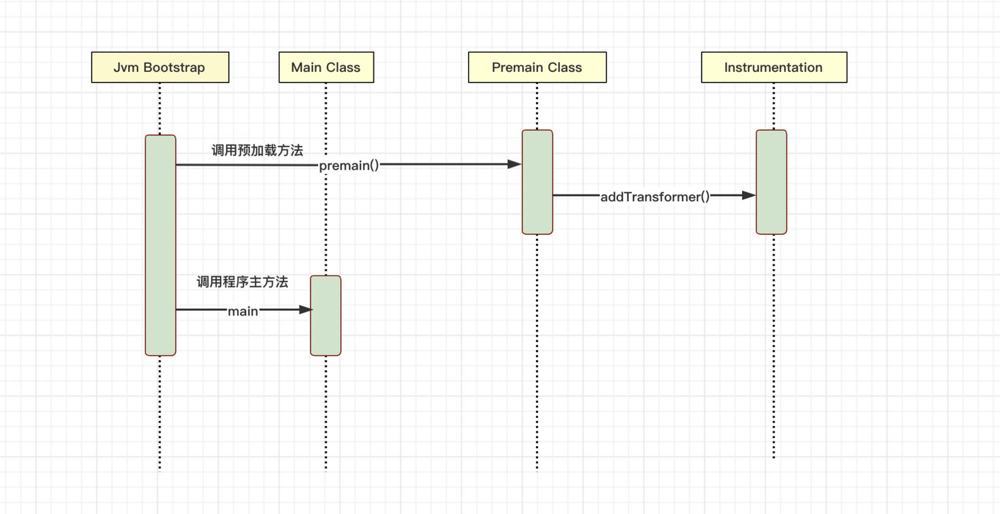
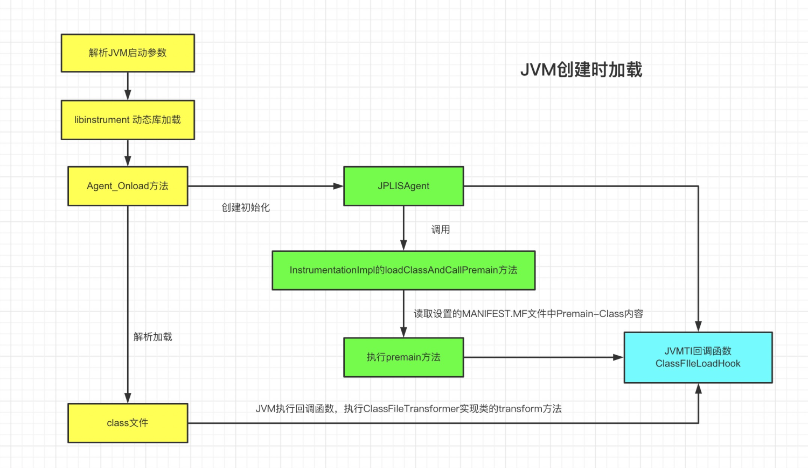
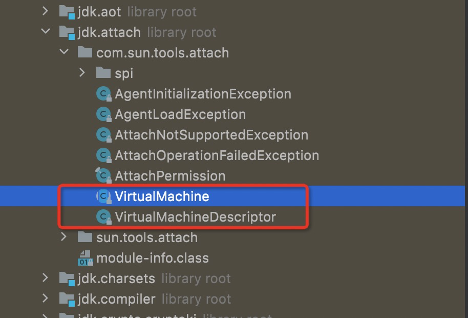
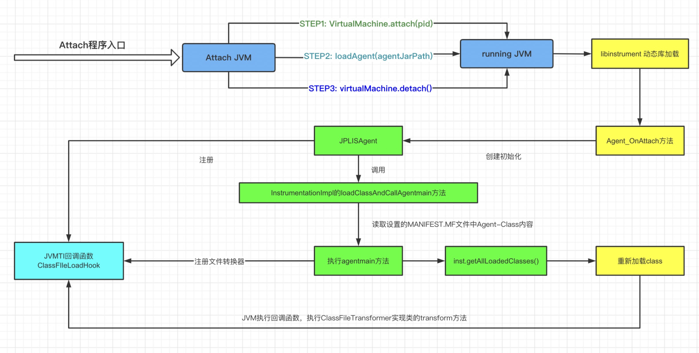
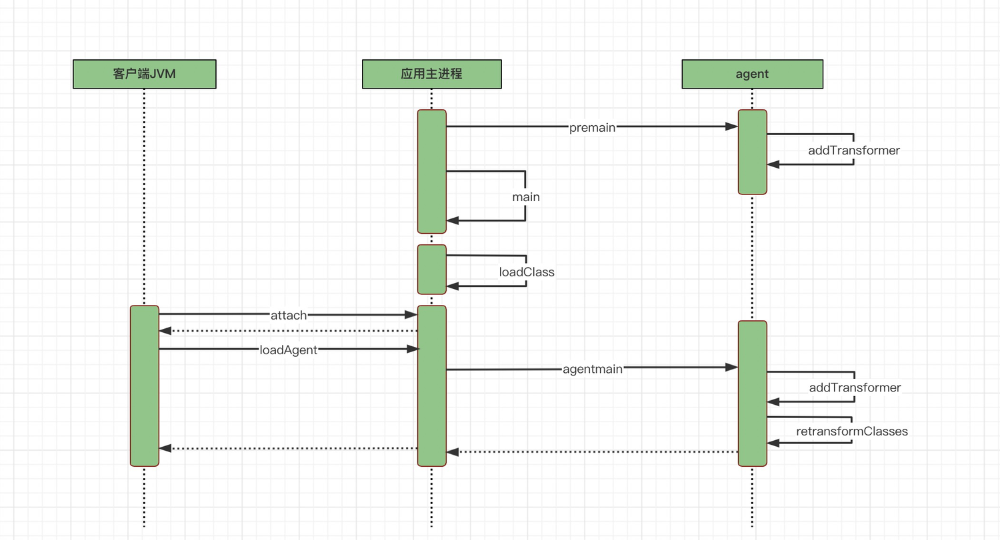
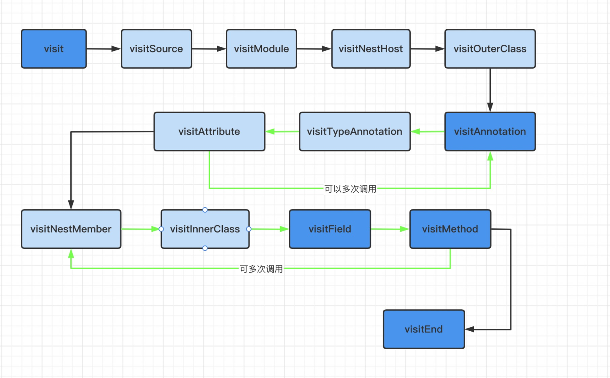

# 背景

> 1、做后台服务开发的时候，springboot每次改动代码都需要手动重启才生效，感觉贼麻烦；后来使用了spring提供的热部署插件 devtools，它可以部分重启，相当于重新加载了我们自己写的代码，效率提高很多。再后来遇到JRebel，它只会重新加载我们修改的那个类，完全规避了重启的消耗，连mybatis的xml文件都能热部署，太方便了有木有！
> 2、业务遇到线上问题时经常需要加log调试，从加一行log到push代码，jekens编译、部署，整个过程时间消耗非常长，甚至有时候需要逐步加日志排查问题，重复很多次修改代码再打包部署，实现费心费力。
> 那可不可以在服务器上直接改代码使之实时生效？结论是可以的！
>
> 而这一切的都是都离不开Java Agent，事实上正是基于Java Agent才得以实现这一切


# 1、什么是Java Agent

Java Agent是JDK1.5引入的新特性，又叫 Java探针、钩子、插桩等等，但做的事情十分明确，它是一个运行在目标JVM的特定程序，职责是负责从目标JVM中获取数据，然后将数据传递给外部进程并处理。
加载agent的时机可以是目标JVM启动之时，也可以是目标JVM运行时进行加载，而在目标JVM运行时进行agent加载具备动态性，对未知的场景来说非常实用。

> 如果说AOP是代码层面的代理程序，那么java agent就可以说是JVM层面的代理程序了，通过使用JVM提供的API（即JVM TI，这里是通过Instrumentation类来完成对应的调用），
> Java Agent能够修改/替换已经被加载的class文件，借此我们能够在原有代码的基础上添加一下非业务的监控代码。


## 1.1、JVMTI

JVMTI（JVM Tool Interface）是一套由Java虚拟机为JVM相关的工具提供的本地编程接口集合，可以支持第三方工具程序以代理的方式连接和访问JVM。
JVMTI是从Java SE5开始引入，整合和取代了以前使用的 JVM Profiler Interface（JVMPI）和 JVM Debug Interface（JVMDI）,它们原来是被用于提供调试Java程序、性能调节的功能，而在Java SE6中，JVMPI 和 JVMDI 已经消失了。
JVMTI本质上是在JVM内部的注册了各种勾子事件，在JVM事件触发时，同时触发预定义的勾子，以实现对各个JVM事件的响应。事件包括类文件加载、异常产生与捕获、线程启动和结束、GC开始和结束、方法调用进入和退出等等。

## 1.2、Agent的实现模式

JVMTI是一套Native接口，在Java SE5之前，要实现一个Agent只能通过编写Native代码来实现。从Java SE5开始，可以使用Java提供的Instrumentation接口来编写Agent，它把Java的Instrument功能从本地代码中解放出来，使之可以用Java代码的方式解决问题。
其实无论是通过Native的方式、还是Java Instrumentation接口的方式编写Agent，它们的工作都是借助JVMTI进行完成的。

## 1.3、Java Instrumentation

> Instrumentation，在计算机科学技术中的英文释义是 插桩、植入。

动态 Instrumentation 是 Java SE5的新特性，它在 java.lang.instrument 包中，它把 Java 的 Instrument 功能从本地代码中释放出来，使用 Instrumentation ，开发者可以构建一个独立于应用程序的代理程序（Agent），用来检测和协助
运行在JVM上的程序，甚至可以替换和修改某些类的定义。这样的特性实际上提供了一种虚拟机级别支持的AOP方式，使得开发者无需对援用应用做任何修改，就可以实现动态修改和增强。

在Java SE5中，Instrument 要求在应用运行前利用命令行参数或者系统内参数设置代理程序，然后在实际运行中，虚拟机在初始化时（在绝大多数的Java类库被载入之前），Instrumentation 的设置已经启动，并在虚拟机中设置了回调函数，
检测特定类的加载情况，并完成实际工作。但是在实际的很多情况下，我们没办法在虚拟机启动之时就为其设定代理，这样实际上限制了 instrument 的应用。

而从Java SE6开始，支持更加强大的动态 Instrument。通过 Java Tool API 中的 attach 方式，我们可以很方便地在应用运行过程中动态地设置加载代理程序。


# 2、如何实现 Java Agent

## 2.1、Instrumentation 核心方法

Instrumentation 是 java.lang.instrument 包下的一个接口，在这个接口中提供了注册类文件转换器、获取所有已加载类等功能，允许我们对未加载、或已经加载的类进行修改。

```java
public class MyClassTransformer implements ClassFileTransformer {
    @Override
    public byte[] transform(ClassLoader loader, String className, Class<?> classBeingRedefined, 
               ProtectionDomain protectionDomain, byte[] classfileBuffer) throws IllegalClassFormatException {
        
        // 在这里读取、转换类文件
        return classfileBuffer;
    }
}

public interface Instrumentation {
   /**
     * 注册一个转换器 Transformer，之后所有的类加载都会被 Transformer 拦截。
     * ClassFileTransformer 类是一个接口，使用时需要实现它，该类只有一个方法，该方法传递类的信息，返回值是转换后的类的字节码文件。
     */
    void addTransformer(ClassFileTransformer transformer, boolean canRetransform);

    /**
     * 对JVM已经加载的类重新触发类加载。使用的就是上面注册的 Transformer。
     * 该方法可以修改方法体、常量池和属性值，但不能新增、删除、重命名属性或方法，也不能修改方法的签名
     */
    void retransformClasses(Class<?>... classes) throws UnmodifiableClassException;
    
    /**
	 * 此方法用于替换类的定义，而不引用现有的类文件字节，就像从源代码重新编译以进行修复和继续调试所做的那样。
     * 在要转换现有类文件字节的地方（例如在字节码插桩中），应该使用 retransformClasses。
     * 该方法可以修改方法体、常量池和属性值，但不能新增、删除、重命名属性或方法，也不能修改方法的签名
     */
 	void redefineClasses(ClassDefinition... definitions) throws  ClassNotFoundException, UnmodifiableClassException;
    
    /**
     * 获取一个对象的大小
     */
    long getObjectSize(Object objectToSize);
    
    /**
     * 将一个jar加入到 bootstrap classloader 的classpath里
     */
    void appendToBootstrapClassLoaderSearch(JarFile jarfile);
    
    /**
     * 获取当前 JVM 加载的所有类对象
     */
    Class[] getAllLoadedClasses();
    
}
```

它的 addTransformer 给 Instrumentation 注册了一个 transformer，transformer 是 ClassFIleTransformer 接口的实例，这个接口中只有一个 transform 方法，调用 addTransformer 设置 transform 以后，后续JVM加载所有类之前都会被这个 transform 拦截，
这个方法接收原来类文件的字节数组，返回转换过的字节数组，在这个方法中可以对类文件做改写。

```java
public class MyClassTransformer implements ClassFileTransformer {
    @Override
    public byte[] transform(ClassLoader loader, String className, Class<?> classBeingRedefined, 
               ProtectionDomain protectionDomain, byte[] classfileBuffer) throws IllegalClassFormatException {
        
        // 在这里读取、转换类文件
        return classfileBuffer;
    }
}

```

## 2.2、JVM启动前静态Instrument

```java
[1] public static void premain(String agentArgs, Instrumentation inst)
    
[2] public static void premain(String agentArgs)
```

JVM将首先寻找带 Instrumentation 签名的方法 [1] ，如果没有发现 [1] ，再寻找 [2]。这个逻辑在 sun.instrument.InstrumentationImpl 类中。


### 2.2.1、使用步骤

1、定义一个 MANIFEST.MF文件，必须包含 Premain-Class 选项，通常也会加入 Can-Redefine-Classees 和 Can-Retransform-Classes 选项。
2、创建一个 Premain-Class 指定的类，其中包含 premain 方法，方法逻辑由用户自己确定。
3、将包含 premain 的类和 MANIFEST.MF文件打成jar包。
4、使用参数 -javaagent:jar包路径 启动要代理的方法。


### 2.2.2、MANIFEST.MF 文件


- Premain-Class:  包含premain方法的类（类的全路径名）
- Agent-Class:  包含agentmain方法的类（类的全路径名）
- Can-Redifine-Classes: true表示能重新定义此代理所需的类，默认值false（可选）
- Can-Retransform-Classes: true表示能重新转换此代理所需的类，默认值false（可选）

### 2.2.3、代理jar与普通jar比较

|                      | 运行时JAR包       | Java Agent JAR包                        |
| -------------------- | ----------------- | --------------------------------------- |
| 入口方法名称         | Main              | Premain                                 |
| MANIFEST.MF 主要参数 | Main-Class        | Premain-Class                           |
| 启动参数             | java -jar xxx.jar | java -javaagent:[path].jar -jar xxx.jar |
| 执行顺序             |                   | 先                                      |
| 是否独立启动         | 是                | 否                                      |


### 2.2.4、代码实战

见代码

### 2.2.5、原理分析

**-> java -javaagent:xxx.jar  -jar -xxxx.jar**

- Java Agent装载时序



- JVM创建解析




## 2.3、JVM启动后动态Instrument

> 比起JVM启动时加载Agent，运行时加载Agent就比较有诱惑力了，因为运行时加载Agent的能力给我们提供了很强的动态性，我们可以在需要的时候按照需求加载Agent来进行一些工作。

跟 premain 函数一样，开发者可以编写一个含有 agentmain 函数的 Java类

```java
// 采用attach机制，被代理的目标程序VM有可能很早之前已经启动，当然其所有类已经被加载完成，
// 这个时候需要借助Instrumentation#retransformClasses(Class<?>... classes)让对应的类可以重新转换，
// 从而激活重新转换的类执行ClassFileTransformer列表中的回调

[1] public static void agentmain (String agentArgs, Instrumentation inst)

[2] public static void agentmain (String agentArgs)
```

同样，agentmain 方法中带 Instrumentation 参数的方法 [1] 也比不带的方法 [2] 优先级更高，开发者必须在 manifest 文件里面设置 Agent-Class 来指定包含 agentmain 函数的类。

### 2.3.1、使用步骤

1、定义一个 MANIFEST.MF文件，必须包含 Agent-Class 选项，设置 Can-Redefine-Classees 和 Can-Retransform-Classes 为true。
2、创建一个 Agent-Class 指定的类，其中包含 agentmain 方法，方法逻辑由用户自己确定。
3、将包含 agentmain 的类和 MANIFEST.MF文件打成jar包。
4、编写程序，通过 VirtualMachine 类的 attach(pid) 方法，挂载到一个运行中的JVM进程对象。
5、调用JVM进程对象的 loadAgent(agentJarPath) 方法，将上面打好的agent的jar包注入到对应的进程，然后对应的进程会调用agentmain方法。

### 2.3.2、MANIFEST.MF 文件

同上

### 2.3.3、Attach API

- Java 6以后支持了动态 Instrument ，该特性主要依赖于 Attach 机制，Attach API很简单，只有2个主要的类，都在 com.sun.tools.attach 包里面



> 1. VirtualMachine字面意义表示一个Java 虚拟机，也就是程序需要监控的目标虚拟机，提供了获取系统信息(比如获取内存dump、线程dump，类信息统计(比如已加载的类以及实例个数等)， loadAgent，Attach 和 Detach （Attach 动作的相反行为，从 JVM 上面解除一个代理）等方法，可以实现的功能可以说非常之强大 。该类允许我们通过给attach方法传入一个jvm的pid(进程id)，远程连接到jvm上 。代理类注入操作只是它众多功能中的一个，通过loadAgent方法向jvm注册一个代理程序agent，在该agent的代理程序中会得到一个Instrumentation实例，该实例可以 在class加载前改变class的字节码，也可以在class加载后重新加载。在调用Instrumentation实例的方法时，这些方法会使用ClassFileTransformer接口中提供的方法进行处理。
> 1. VirtualMachineDescriptor 则是一个描述虚拟机的容器类，配合 VirtualMachine 类完成各种功能。


- 本节需要使用到 VirtualMachine 的核心API

```java
/**
 * 获取当前机器所有的JVM实例
 */
public static List<VirtualMachineDescriptor> list() {}

/**
 * 传递一个进程号作为参数，返回目标jvm进程的vm对象。该方法其实是JVM进程之间指定传递的桥梁，底层通过该socket进行通信。
 * JVM A 可以发送一些指令给 JVM B，B收到指令之后，可以执行对应的逻辑，比如在命令行中经常使用的 jstack、jcmd、jps等，
 * 很多都是基于这种机制实现的。
 */
public static VirtualMachine attach(String id) throws AttachNotSupportedException, IOException{}

/**
 * 该方法允许我们将 agent 对应的jar包地址作为参数传递给目标jvm，目标jvm收到命令后去加载这个agent
 */
public void loadAgent(String agent) throws AgentLoadException, AgentInitializationException, IOException{}
```

### 3.3.4、代码实战

见代码


### 3.3.5、原理分析

- Attach运行解析




## 2.4、总结

- Java Agent 加载时序图




# 3、如何操作字节码

> 在字节码操作中目前有三个比较常用的框架；ASM、Javassist、Byte Buddy，这几个框架都能进行字节码操作，其中ASM 更偏向于底层，需要了解字节码指令以及操作数栈等知识，另外两个框架是对 ASM 的封装，提供更加高级的API去操作字节码。

## 3.1、ASM

对于需要手动操作字节码的需求，可以使用ASM，他可以直接生产 .class字节码文件，也可以在类被加载入JVM之前动态修改类行为。
ASM的应用场景有AOP（Cglib就是基于ASM）、热部署、修改其他jar包中的类等。

- 可以将ASM理解为对类文件的CRUD，经过CRUD的字节码可以转换为类。


- visitor处理流程




## 3.2、Javassist

ASM是在指定层次操作字节码的，使用起来比较晦涩，而Javassist是强调在源代码层次操作字节码的框架，利用Javassist实现字节码增强时，可以直接使用java编码的方式，而不需要了解虚拟机指令。


## 3.3、Byte Buddy

ByteBuddy是一个开源的Java库，其只要功能是帮助用户屏蔽字节码操作，以及复杂的Instrumentation API。ByteBuddy提供了一套类型安全的API和注解，我们可以直接使用这些API和注解轻松实现复杂的字节码操作。


# 4、探索热部署


# 5、Java Agent 实战


# 6、扩展

```shell
# 1、启动arthas
java -jar arthas-boot.jar

# 2、sc: search class 查找文件
sc *TransClass

# 3、jad 反编译class 并输出到文件
jad --source-only com.mk.agent.web.demo.TransClass > /tmp/agent/TransClass.java

# 4、修改源代码
vi /tmp/agent/TransClass.java

# 5、sc查找加载 TransClass 的 ClassLoader，-d参数可以打印出类加载的具体信息
sc -d *TransClass | grep classLoaderHash

# 6、编译源代码，使用mc（Memory Compiler）命令编译，并且通过-c参数指定 ClassLoader
mc -c 512ddf17 /tmp/agent/TransClass.java -d /tmp/agent

# 7、使用redefine命令重新加载新编译好的class
redefine /tmp/agent/com/mk/agent/web/demo/TransClass.class

# redefine成功之后，访问controller进行调用，观察代码是否生效
```

