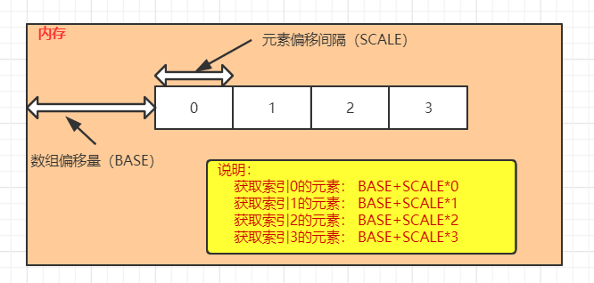
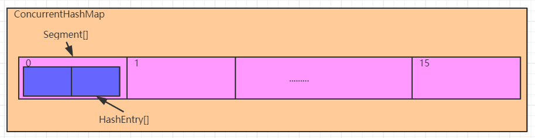
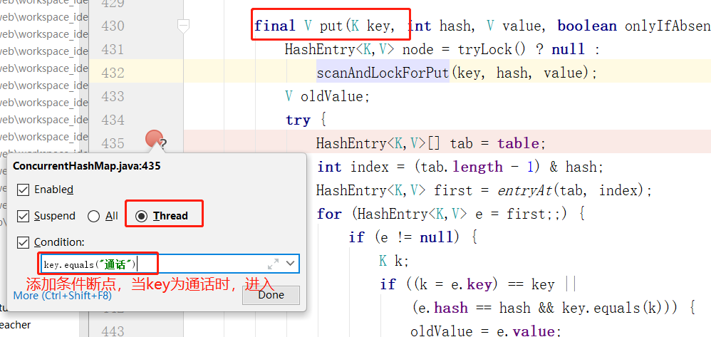
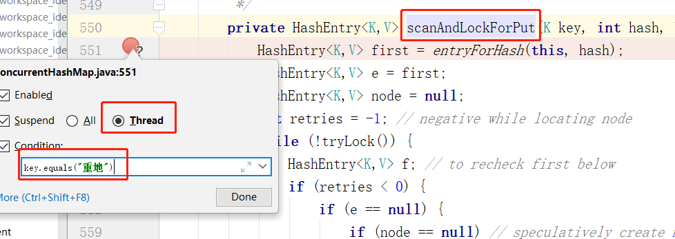
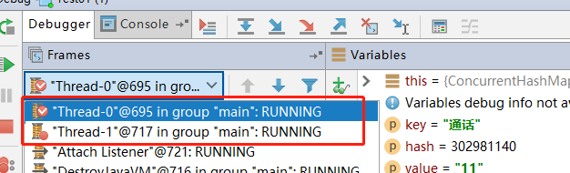
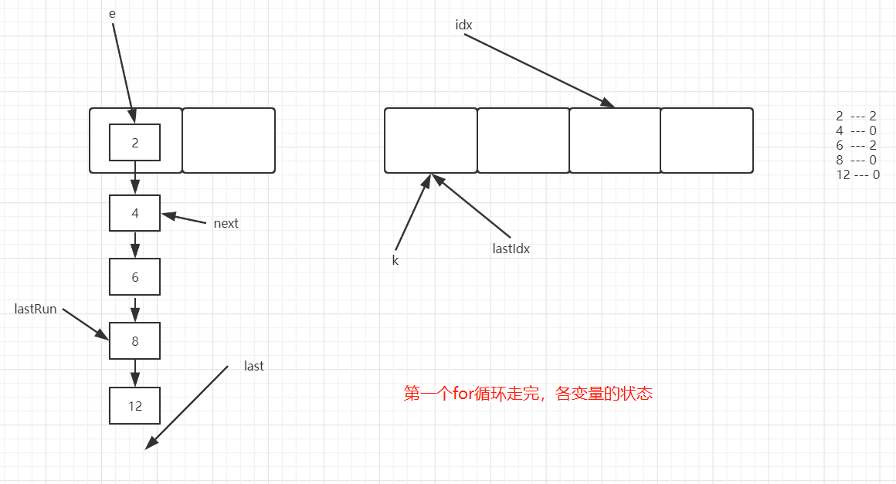
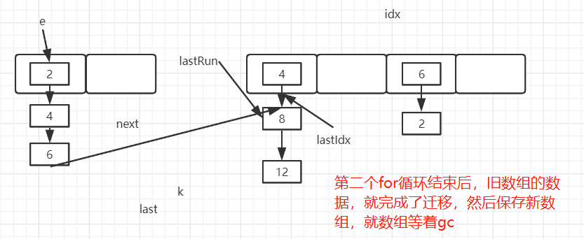
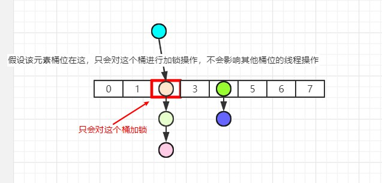
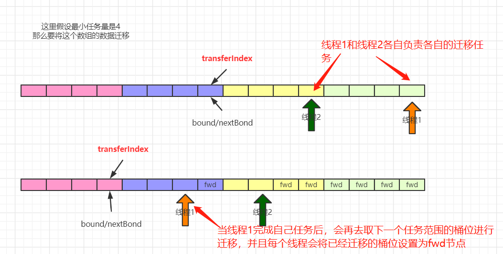
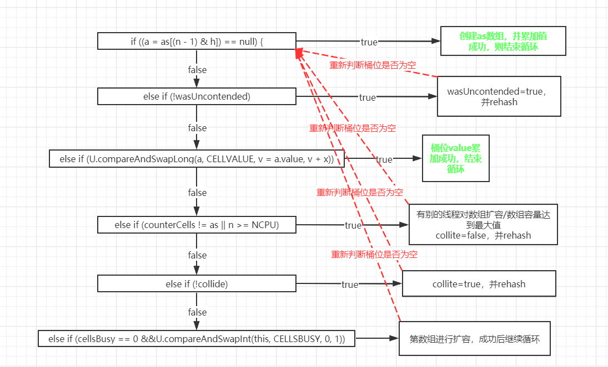

## 	ConcurrentHashMap源码分析


## jdk1.7

### 一、Unsafe介绍

#### 1、Unsafe简介

Unsafe类相当于是一个java语言中的后门类，**提供了硬件级别的原子操作**，所以在一些并发编程中被大量使用。jdk已经作出说明，该类对程序员而言不是一个安全操作，在后续的jdk升级过程中，可能会禁用该类。所以这个类的使用是一把双刃剑，实际项目中谨慎使用，以免造成jdk升级不兼容问题。

#### 2、Unsafe Api

这里并不系统讲解Unsafe的所有功能，只介绍和接下来内容相关的操作

`arrayBaseOffset`：获取数组的基础偏移量

`arrayIndexScale`：获取数组中元素的偏移间隔，要获取对应所以的元素，将索引号和该值相乘，获得数组中指定角标元素的偏移量

`getObjectVolatile`：获取对象上的属性值或者数组中的元素

`getObject`：获取对象上的属性值或者数组中的元素，已过时

`putOrderedObject`：设置对象的属性值或者数组中某个角标的元素，更高效

`putObjectVolatile`：设置对象的属性值或者数组中某个角标的元素

`putObject`：设置对象的属性值或者数组中某个角标的元素，已过时

#### 3、代码演示

```java
public class Test02 {

    public static void main(String[] args) throws Exception {
        Integer[] arr = {2,5,1,8,10};

        //获取Unsafe对象
        Unsafe unsafe = getUnsafe();
        //获取Integer[]的基础偏移量
        int baseOffset = unsafe.arrayBaseOffset(Integer[].class);
        //获取Integer[]中元素的偏移间隔
        int indexScale = unsafe.arrayIndexScale(Integer[].class);

        //获取数组中索引为2的元素对象
        Object o = unsafe.getObjectVolatile(arr, (2 * indexScale) + baseOffset);
        System.out.println(o); //1

        //设置数组中索引为2的元素值为100
        unsafe.putOrderedObject(arr,(2 * indexScale) + baseOffset,100);

        System.out.println(Arrays.toString(arr));//[2, 5, 100, 8, 10]
    }

    //反射获取Unsafe对象
    public static Unsafe getUnsafe() throws Exception {
        Field theUnsafe = Unsafe.class.getDeclaredField("theUnsafe");
        theUnsafe.setAccessible(true);
        return (Unsafe) theUnsafe.get(null);
    }
}
```

##### 3.1、图解说明




### 二、jdk1.7容器初始化

#### 1、源码解析

> 无参构造

```java
//空参构造
public ConcurrentHashMap() {
    //调用本类的带参构造
    //DEFAULT_INITIAL_CAPACITY = 16
    //DEFAULT_LOAD_FACTOR = 0.75f
    //int DEFAULT_CONCURRENCY_LEVEL = 16
    this(DEFAULT_INITIAL_CAPACITY, DEFAULT_LOAD_FACTOR, DEFAULT_CONCURRENCY_LEVEL);
}
```

> 三个参数的构造：一些非核心逻辑的代码已经省略

```java
//initialCapacity 定义ConcurrentHashMap存放元素的容量
//concurrencyLevel 定义ConcurrentHashMap中Segment[]的大小
public ConcurrentHashMap(int initialCapacity,
                         float loadFactor, int concurrencyLevel) {
   
    int sshift = 0;
    int ssize = 1;
    //计算Segment[]的大小，保证是2的幂次方数
    while (ssize < concurrencyLevel) {
        ++sshift;
        ssize <<= 1;
    }
    //这两个值用于后面计算Segment[]的角标
    this.segmentShift = 32 - sshift;
    this.segmentMask = ssize - 1;
    
    //计算每个Segment中存储元素的个数
    int c = initialCapacity / ssize;
    if (c * ssize < initialCapacity)
        ++c;
    //最小Segment中存储元素的个数为2
    int cap = MIN_SEGMENT_TABLE_CAPACITY;
    ////矫正每个Segment中存储元素的个数，保证是2的幂次方，最小为2
    while (cap < c)
        cap <<= 1;
    //创建一个Segment对象，作为其他Segment对象的模板
    Segment<K,V> s0 =
        new Segment<K,V>(loadFactor, (int)(cap * loadFactor),
                         (HashEntry<K,V>[])new HashEntry[cap]);
    Segment<K,V>[] ss = (Segment<K,V>[])new Segment[ssize];
    //利用Unsafe类，将创建的Segment对象存入0角标位置
    UNSAFE.putOrderedObject(ss, SBASE, s0); // ordered write of segments[0]
    this.segments = ss;
}
```

> 综上：ConcurrentHashMap中保存了一个**默认长度为16的Segment[]**，每个Segment元素中保存了一个**默认长度为2的HashEntry[]**，我们添加的元素，是存入对应的Segment中的HashEntry[]中。所以ConcurrentHashMap中默认元素的长度是32个，而不是16个

#### 2、图解



#### 3、Segment是什么？

```java
static final class Segment<K,V> extends ReentrantLock implements Serializable {
	...
}
```

> 我们发现Segment是继承自ReentrantLock的，学过线程的兄弟都知道，它可以实现同步操作，从而保证多线程下的安全。因为每个Segment之间的锁互不影响，所以我们也将ConcurrentHashMap中的这种锁机制称之为**分段锁**，这比HashTable的线程安全操作高效的多。

#### 4、HashEntry是什么？

```java
//ConcurrentHashMap中真正存储数据的对象
static final class HashEntry<K,V> {
    final int hash; //通过运算，得到的键的hash值
    final K key; // 存入的键
    volatile V value; //存入的值
    volatile HashEntry<K,V> next; //记录下一个元素，形成单向链表

    HashEntry(int hash, K key, V value, HashEntry<K,V> next) {
        this.hash = hash;
        this.key = key;
        this.value = value;
        this.next = next;
    }
}
```

### 三、jdk1.7添加安全

#### 1、源码分析

##### 1.1、ConcurrentHashMap的put方法

```java
public V put(K key, V value) {
    Segment<K,V> s;
    if (value == null)
        throw new NullPointerException();
    //基于key，计算hash值
    int hash = hash(key);
    //因为一个键要计算两个数组的索引，为了避免冲突，这里取高位计算Segment[]的索引
    int j = (hash >>> segmentShift) & segmentMask;
    //判断该索引位的Segment对象是否创建，没有就创建
    if ((s = (Segment<K,V>)UNSAFE.getObject          // nonvolatile; recheck
         (segments, (j << SSHIFT) + SBASE)) == null) //  in ensureSegment
        s = ensureSegment(j);
    //调用Segmetn的put方法实现元素添加
    return s.put(key, hash, value, false);
}
```

##### 1.2、ConcurrentHashMap的ensureSegment方法

```JAVA
//创建对应索引位的Segment对象，并返回
private Segment<K,V> ensureSegment(int k) {
    final Segment<K,V>[] ss = this.segments;
    long u = (k << SSHIFT) + SBASE; // raw offset
    Segment<K,V> seg;
    //获取，如果为null，即创建
    if ((seg = (Segment<K,V>)UNSAFE.getObjectVolatile(ss, u)) == null) {
        //以0角标位的Segment为模板
        Segment<K,V> proto = ss[0]; // use segment 0 as prototype
        int cap = proto.table.length;
        float lf = proto.loadFactor;
        int threshold = (int)(cap * lf);
        HashEntry<K,V>[] tab = (HashEntry<K,V>[])new HashEntry[cap];
        //获取，如果为null，即创建
        if ((seg = (Segment<K,V>)UNSAFE.getObjectVolatile(ss, u))
            == null) { // recheck
            //创建
            Segment<K,V> s = new Segment<K,V>(lf, threshold, tab);
            //自旋方式，将创建的Segment对象放到Segment[]中，确保线程安全
            while ((seg = (Segment<K,V>)UNSAFE.getObjectVolatile(ss, u))
                   == null) {
                if (UNSAFE.compareAndSwapObject(ss, u, null, seg = s))
                    break;
            }
        }
    }
    //返回
    return seg;
}
```

##### 1.3、Segment的put方法

```java
final V put(K key, int hash, V value, boolean onlyIfAbsent) {
    //尝试获取锁，获取成功，node为null，代码向下执行
    //如果有其他线程占据锁对象，那么去做别的事情，而不是一直等待，提升效率
    //scanAndLockForPut 稍后分析
    HashEntry<K,V> node = tryLock() ? null :
        scanAndLockForPut(key, hash, value);
    V oldValue;
    try {
        HashEntry<K,V>[] tab = table;
        //取hash的低位，计算HashEntry[]的索引
        int index = (tab.length - 1) & hash;
        //获取索引位的元素对象
        HashEntry<K,V> first = entryAt(tab, index);
        for (HashEntry<K,V> e = first;;) {
            //获取的元素对象不为空
            if (e != null) {
                K k;
                //如果是重复元素，覆盖原值
                if ((k = e.key) == key ||
                    (e.hash == hash && key.equals(k))) {
                    oldValue = e.value;
                    if (!onlyIfAbsent) {
                        e.value = value;
                        ++modCount;
                    }
                    break;
                }
                //如果不是重复元素，获取链表的下一个元素，继续循环遍历链表
                e = e.next;
            }
            else { //如果获取到的元素为空
                //当前添加的键值对的HashEntry对象已经创建
                if (node != null)
                    node.setNext(first); //头插法关联即可
                else
                    //创建当前添加的键值对的HashEntry对象
                    node = new HashEntry<K,V>(hash, key, value, first);
                //添加的元素数量递增
                int c = count + 1;
                //判断是否需要扩容
                if (c > threshold && tab.length < MAXIMUM_CAPACITY)
                    //需要扩容
                    rehash(node);
                else
                    //不需要扩容
                    //将当前添加的元素对象，存入数组角标位，完成头插法添加元素
                    setEntryAt(tab, index, node);
                ++modCount;
                count = c;
                oldValue = null;
                break;
            }
        }
    } finally {
        //释放锁
        unlock();
    }
    return oldValue;
}
```

##### 1.4、Segment的scanAndLockForPut方法

> 该方法在线程没有获取到锁的情况下，去完成HashEntry对象的创建，提升效率
>
> 但是这个操作个人感觉有点累赘了。

```java
private HashEntry<K,V> scanAndLockForPut(K key, int hash, V value) {
    //获取头部元素
    HashEntry<K,V> first = entryForHash(this, hash);
    HashEntry<K,V> e = first;
    HashEntry<K,V> node = null；
    int retries = -1; // negative while locating node
    while (!tryLock()) {
        //获取锁失败
        HashEntry<K,V> f; // to recheck first below
        if (retries < 0) {
            //没有下一个节点，并且也不是重复元素，创建HashEntry对象，不再遍历
            if (e == null) {
                if (node == null) // speculatively create node
                    node = new HashEntry<K,V>(hash, key, value, null);
                retries = 0;
            }
            else if (key.equals(e.key))
                //重复元素，不创建HashEntry对象，不再遍历
                retries = 0;
            else
                //继续遍历下一个节点
                e = e.next;
        }
        else if (++retries > MAX_SCAN_RETRIES) {
            //如果尝试获取锁的次数过多，直接阻塞
            //MAX_SCAN_RETRIES会根据可用cpu核数来确定
            lock();
            break;
        }
        else if ((retries & 1) == 0 &&
                 (f = entryForHash(this, hash)) != first) {
            //如果期间有别的线程获取锁，重新遍历
            e = first = f; // re-traverse if entry changed
            retries = -1;
        }
    }
    return node;
}
```

#### 2、模拟多线程的代码流程

> 这里“通话”和“重地”的哈希值是一样的，那么他们添加时，会存入同一个Segment对象，必然会存在锁竞争

```java
public static void main(String[] args) throws Exception {
    final ConcurrentHashMap chm = new ConcurrentHashMap();

    new Thread(){
        @Override
        public void run() {
            chm.put("通话","11");
            System.out.println("-----------");
        }
    }.start();

	//让第一个线程先启动，进入put方法
    Thread.sleep(1000);

    new Thread(){
        @Override
        public void run() {
            chm.put("重地","22");
            System.out.println("===========");
        }
    }.start();
}
```

##### 2.1、多线程环境下的条件断点设置





##### 2.2、运行结果

> 会发现两个线程，分别停在不同的断点位置，这就是多线程锁互斥产生的结果
>
> 然后就可以分别让不同的线程向下执行，查看代码走向了。




### 四、jdk1.7扩容安全

#### 1、源码分析

```java
private void rehash(HashEntry<K,V> node) {
    HashEntry<K,V>[] oldTable = table;
    int oldCapacity = oldTable.length;
    //两倍容量
    int newCapacity = oldCapacity << 1;
    threshold = (int)(newCapacity * loadFactor);
    //基于新容量，创建HashEntry数组
    HashEntry<K,V>[] newTable =
        (HashEntry<K,V>[]) new HashEntry[newCapacity];
    int sizeMask = newCapacity - 1;
   	//实现数据迁移
    for (int i = 0; i < oldCapacity ; i++) {
        HashEntry<K,V> e = oldTable[i];
        if (e != null) {
            HashEntry<K,V> next = e.next;
            int idx = e.hash & sizeMask;
            if (next == null)   //  Single node on list
                //原位置只有一个元素，直接放到新数组即可
                newTable[idx] = e;
            else { // Reuse consecutive sequence at same slot
                //=========图一=====================
                HashEntry<K,V> lastRun = e;
                int lastIdx = idx;
                for (HashEntry<K,V> last = next;
                     last != null;
                     last = last.next) {
                    int k = last.hash & sizeMask;
                    if (k != lastIdx) {
                        lastIdx = k;
                        lastRun = last;
                    }
                }
                //=========图一=====================
                
                //=========图二=====================
                newTable[lastIdx] = lastRun;
                //=========图二=====================
                // Clone remaining nodes
                //=========图三=====================
                for (HashEntry<K,V> p = e; p != lastRun; p = p.next) {
                    V v = p.value;
                    int h = p.hash;
                    int k = h & sizeMask;
                    HashEntry<K,V> n = newTable[k];
                    //这里旧的HashEntry不会放到新数组
                    //而是基于原来的数据创建了一个新的HashEntry对象，放入新数组
                    newTable[k] = new HashEntry<K,V>(h, p.key, v, n);
                }
                //=========图三=====================
            }
        }
    }
    //采用头插法，将新元素加入到数组中
    int nodeIndex = node.hash & sizeMask; // add the new node
    node.setNext(newTable[nodeIndex]);
    newTable[nodeIndex] = node;
    table = newTable;
}
```

#### 2、图解

> 图一



> 图二


> 图三




### 五、jdk1.7集合长度获取

#### 1、源码分析

```java
public int size() {
    // Try a few times to get accurate count. On failure due to
    // continuous async changes in table, resort to locking.
    final Segment<K,V>[] segments = this.segments;
    int size;
    boolean overflow; // true if size overflows 32 bits
    long sum;         // sum of modCounts
    long last = 0L;   // previous sum
    int retries = -1; // first iteration isn't retry
    try {
        for (;;) {
            //当第5次走到这个地方时，会将整个Segment[]的所有Segment对象锁住
            if (retries++ == RETRIES_BEFORE_LOCK) {
                for (int j = 0; j < segments.length; ++j)
                    ensureSegment(j).lock(); // force creation
            }
            sum = 0L;
            size = 0;
            overflow = false;
            for (int j = 0; j < segments.length; ++j) {
                Segment<K,V> seg = segmentAt(segments, j);
                if (seg != null) {
                    //累加所有Segment的操作次数
                    sum += seg.modCount;
                    int c = seg.count;
                    //累加所有segment中的元素个数 size+=c
                    if (c < 0 || (size += c) < 0)
                        overflow = true;
                }
            }
            //当这次累加值和上一次累加值一样，证明没有进行新的增删改操作，返回sum
            //第一次last为0，如果有元素的话，这个for循环最少循环两次的
            if (sum == last)
                break;
            //记录累加的值
            last = sum;
        }
    } finally {
        //如果之前有锁住，解锁
        if (retries > RETRIES_BEFORE_LOCK) {
            for (int j = 0; j < segments.length; ++j)
                segmentAt(segments, j).unlock();
        }
    }
    //溢出，返回int的最大值，否则返回累加的size
    return overflow ? Integer.MAX_VALUE : size;
}
```


## jdk1.8


### 一、jdk1.8容器初始化

#### 1、源码分析

> 在jdk8的ConcurrentHashMap中一共有5个构造方法，这四个构造方法中都没有对内部的数组做初始化， 只是对一些变量的初始值做了处理
>
> jdk8的ConcurrentHashMap的数组初始化是在第一次添加元素时完成

```java
//没有维护任何变量的操作，如果调用该方法，数组长度默认是16
public ConcurrentHashMap() {
}
```

```java
//传递进来一个初始容量，ConcurrentHashMap会基于这个值计算一个比这个值大的2的幂次方数作为初始容量
public ConcurrentHashMap(int initialCapacity) {
    if (initialCapacity < 0)
        throw new IllegalArgumentException();
    int cap = ((initialCapacity >= (MAXIMUM_CAPACITY >>> 1)) ?
               MAXIMUM_CAPACITY :
               tableSizeFor(initialCapacity + (initialCapacity >>> 1) + 1));
    this.sizeCtl = cap;
}
```

> 注意，调用这个方法，得到的初始容量和我们之前讲的HashMap以及jdk7的ConcurrentHashMap不同，即使你传递的是一个2的幂次方数，该方法计算出来的初始容量依然是比这个值大的2的幂次方数

```java
//调用两个参数的构造
public ConcurrentHashMap(int initialCapacity, float loadFactor) {
    this(initialCapacity, loadFactor, 1);
}
```

```java
//计算一个大于或者等于给定的容量值，该值是2的幂次方数作为初始容量
public ConcurrentHashMap(int initialCapacity,
                         float loadFactor, int concurrencyLevel) {
    if (!(loadFactor > 0.0f) || initialCapacity < 0 || concurrencyLevel <= 0)
        throw new IllegalArgumentException();
    if (initialCapacity < concurrencyLevel)   // Use at least as many bins
        initialCapacity = concurrencyLevel;   // as estimated threads
    long size = (long)(1.0 + (long)initialCapacity / loadFactor);
    int cap = (size >= (long)MAXIMUM_CAPACITY) ?
        MAXIMUM_CAPACITY : tableSizeFor((int)size);
    this.sizeCtl = cap;
}
```

```java
//基于一个Map集合，构建一个ConcurrentHashMap
//初始容量为16
public ConcurrentHashMap(Map<? extends K, ? extends V> m) {
    this.sizeCtl = DEFAULT_CAPACITY;
    putAll(m);
}
```

#### 2、`sizeCtl`含义解释

> **注意：以上这些构造方法中，都涉及到一个变量`sizeCtl`，这个变量是一个非常重要的变量，而且具有非常丰富的含义，它的值不同，对应的含义也不一样，这里我们先对这个变量不同的值的含义做一下说明，后续源码分析过程中，进一步解释**
>
> `sizeCtl`为0，代表数组未初始化， 且数组的初始容量为16
>
> `sizeCtl`为正数，如果数组未初始化，那么其记录的是数组的初始容量，如果数组已经初始化，那么其记录的是数组的扩容阈值
>
> `sizeCtl`为-1，表示数组正在进行初始化
>
> `sizeCtl`小于0，并且不是-1，表示数组正在扩容， -(1+n)，表示此时有n个线程正在共同完成数组的扩容操作

### 二、jdk1.8添加安全

#### 1、源码分析

##### 1.1、添加元素put/putVal方法

```java
public V put(K key, V value) {
    return putVal(key, value, false);
}
```

```java
final V putVal(K key, V value, boolean onlyIfAbsent) {
    //如果有空值或者空键，直接抛异常
    if (key == null || value == null) throw new NullPointerException();
    //基于key计算hash值，并进行一定的扰动
    int hash = spread(key.hashCode());
    //记录某个桶上元素的个数，如果超过8个，会转成红黑树
    int binCount = 0;
    for (Node<K,V>[] tab = table;;) {
        Node<K,V> f; int n, i, fh;
        //如果数组还未初始化，先对数组进行初始化
        if (tab == null || (n = tab.length) == 0)
            tab = initTable();
	    //如果hash计算得到的桶位置没有元素，利用cas将元素添加
        else if ((f = tabAt(tab, i = (n - 1) & hash)) == null) {
            //cas+自旋（和外侧的for构成自旋循环），保证元素添加安全
            if (casTabAt(tab, i, null,
                         new Node<K,V>(hash, key, value, null)))
                break;                   // no lock when adding to empty bin
        }
        //如果hash计算得到的桶位置元素的hash值为MOVED，证明正在扩容，那么协助扩容
        else if ((fh = f.hash) == MOVED)
            tab = helpTransfer(tab, f);
        else {
            //hash计算的桶位置元素不为空，且当前没有处于扩容操作，进行元素添加
            V oldVal = null;
            //对当前桶进行加锁，保证线程安全，执行元素添加操作
            synchronized (f) {
                if (tabAt(tab, i) == f) {
                    //普通链表节点
                    if (fh >= 0) {
                        binCount = 1;
                        for (Node<K,V> e = f;; ++binCount) {
                            K ek;
                            if (e.hash == hash &&
                                ((ek = e.key) == key ||
                                 (ek != null && key.equals(ek)))) {
                                oldVal = e.val;
                                if (!onlyIfAbsent)
                                    e.val = value;
                                break;
                            }
                            Node<K,V> pred = e;
                            if ((e = e.next) == null) {
                                pred.next = new Node<K,V>(hash, key,
                                                          value, null);
                                break;
                            }
                        }
                    }
                    //树节点，将元素添加到红黑树中
                    else if (f instanceof TreeBin) {
                        Node<K,V> p;
                        binCount = 2;
                        if ((p = ((TreeBin<K,V>)f).putTreeVal(hash, key,
                                                       value)) != null) {
                            oldVal = p.val;
                            if (!onlyIfAbsent)
                                p.val = value;
                        }
                    }
                }
            }
            if (binCount != 0) {
                //链表长度大于/等于8，将链表转成红黑树
                if (binCount >= TREEIFY_THRESHOLD)
                    treeifyBin(tab, i);
                //如果是重复键，直接将旧值返回
                if (oldVal != null)
                    return oldVal;
                break;
            }
        }
    }
    //添加的是新元素，维护集合长度，并判断是否要进行扩容操作
    addCount(1L, binCount);
    return null;
}
```

> **通过以上源码，我们可以看到，当需要添加元素时，会针对当前元素所对应的桶位进行加锁操作，这样一方面保证元素添加时，多线程的安全，同时对某个桶位加锁不会影响其他桶位的操作，进一步提升多线程的并发效率**

##### 1.2、数组初始化，initTable方法

```java
private final Node<K,V>[] initTable() {
    Node<K,V>[] tab; int sc;
    //cas+自旋，保证线程安全，对数组进行初始化操作
    while ((tab = table) == null || tab.length == 0) {
        //如果sizeCtl的值（-1）小于0，说明此时正在初始化， 让出cpu
        if ((sc = sizeCtl) < 0)
            Thread.yield(); // lost initialization race; just spin
        //cas修改sizeCtl的值为-1，修改成功，进行数组初始化，失败，继续自旋
        else if (U.compareAndSwapInt(this, SIZECTL, sc, -1)) {
            try {
                if ((tab = table) == null || tab.length == 0) {
                    //sizeCtl为0，取默认长度16，否则去sizeCtl的值
                    int n = (sc > 0) ? sc : DEFAULT_CAPACITY;
                    @SuppressWarnings("unchecked")
                    //基于初始长度，构建数组对象
                    Node<K,V>[] nt = (Node<K,V>[])new Node<?,?>[n];
                    table = tab = nt;
                    //计算扩容阈值，并赋值给sc
                    sc = n - (n >>> 2);
                }
            } finally {
                //将扩容阈值，赋值给sizeCtl
                sizeCtl = sc;
            }
            break;
        }
    }
    return tab;
}
```

#### 2、图解

##### 2.1、put加锁图解




### 三、jdk1.8扩容安全

#### 1、源码分析

```java
private final void transfer(Node<K,V>[] tab, Node<K,V>[] nextTab) {
    int n = tab.length, stride;
    //如果是多cpu，那么每个线程划分任务，最小任务量是16个桶位的迁移
    if ((stride = (NCPU > 1) ? (n >>> 3) / NCPU : n) < MIN_TRANSFER_STRIDE)
        stride = MIN_TRANSFER_STRIDE; // subdivide range
    //如果是扩容线程，此时新数组为null
    if (nextTab == null) {            // initiating
        try {
            @SuppressWarnings("unchecked")
            //两倍扩容创建新数组
            Node<K,V>[] nt = (Node<K,V>[])new Node<?,?>[n << 1];
            nextTab = nt;
        } catch (Throwable ex) {      // try to cope with OOME
            sizeCtl = Integer.MAX_VALUE;
            return;
        }
        nextTable = nextTab;
        //记录线程开始迁移的桶位，从后往前迁移
        transferIndex = n;
    }
    //记录新数组的末尾
    int nextn = nextTab.length;
    //已经迁移的桶位，会用这个节点占位（这个节点的hash值为-1--MOVED）
    ForwardingNode<K,V> fwd = new ForwardingNode<K,V>(nextTab);
    boolean advance = true;
    boolean finishing = false; // to ensure sweep before committing nextTab
    for (int i = 0, bound = 0;;) {
        Node<K,V> f; int fh;
        while (advance) {
            int nextIndex, nextBound;
            //i记录当前正在迁移桶位的索引值
            //bound记录下一次任务迁移的开始桶位
            
            //--i >= bound 成立表示当前线程分配的迁移任务还没有完成
            if (--i >= bound || finishing)
                advance = false;
            //没有元素需要迁移 -- 后续会去将扩容线程数减1，并判断扩容是否完成
            else if ((nextIndex = transferIndex) <= 0) {
                i = -1;
                advance = false;
            }
            //计算下一次任务迁移的开始桶位，并将这个值赋值给transferIndex
            else if (U.compareAndSwapInt
                     (this, TRANSFERINDEX, nextIndex,
                      nextBound = (nextIndex > stride ?
                                   nextIndex - stride : 0))) {
                bound = nextBound;
                i = nextIndex - 1;
                advance = false;
            }
        }
        //如果没有更多的需要迁移的桶位，就进入该if
        if (i < 0 || i >= n || i + n >= nextn) {
            int sc;
            //扩容结束后，保存新数组，并重新计算扩容阈值，赋值给sizeCtl
            if (finishing) {
                nextTable = null;
                table = nextTab;
                sizeCtl = (n << 1) - (n >>> 1);
                return;
            }
		   //扩容任务线程数减1
            if (U.compareAndSwapInt(this, SIZECTL, sc = sizeCtl, sc - 1)) {
                //判断当前所有扩容任务线程是否都执行完成
                if ((sc - 2) != resizeStamp(n) << RESIZE_STAMP_SHIFT)
                    return;
                //所有扩容线程都执行完，标识结束
                finishing = advance = true;
                i = n; // recheck before commit
            }
        }
        //当前迁移的桶位没有元素，直接在该位置添加一个fwd节点
        else if ((f = tabAt(tab, i)) == null)
            advance = casTabAt(tab, i, null, fwd);
        //当前节点已经被迁移
        else if ((fh = f.hash) == MOVED)
            advance = true; // already processed
        else {
            //当前节点需要迁移，加锁迁移，保证多线程安全
            //此处迁移逻辑和jdk7的ConcurrentHashMap相同，不再赘述
            synchronized (f) {
                if (tabAt(tab, i) == f) {
                    Node<K,V> ln, hn;
                    if (fh >= 0) {
                        int runBit = fh & n;
                        Node<K,V> lastRun = f;
                        for (Node<K,V> p = f.next; p != null; p = p.next) {
                            int b = p.hash & n;
                            if (b != runBit) {
                                runBit = b;
                                lastRun = p;
                            }
                        }
                        if (runBit == 0) {
                            ln = lastRun;
                            hn = null;
                        }
                        else {
                            hn = lastRun;
                            ln = null;
                        }
                        for (Node<K,V> p = f; p != lastRun; p = p.next) {
                            int ph = p.hash; K pk = p.key; V pv = p.val;
                            if ((ph & n) == 0)
                                ln = new Node<K,V>(ph, pk, pv, ln);
                            else
                                hn = new Node<K,V>(ph, pk, pv, hn);
                        }
                        setTabAt(nextTab, i, ln);
                        setTabAt(nextTab, i + n, hn);
                        setTabAt(tab, i, fwd);
                        advance = true;
                    }
                    else if (f instanceof TreeBin) {
                        TreeBin<K,V> t = (TreeBin<K,V>)f;
                        TreeNode<K,V> lo = null, loTail = null;
                        TreeNode<K,V> hi = null, hiTail = null;
                        int lc = 0, hc = 0;
                        for (Node<K,V> e = t.first; e != null; e = e.next) {
                            int h = e.hash;
                            TreeNode<K,V> p = new TreeNode<K,V>
                                (h, e.key, e.val, null, null);
                            if ((h & n) == 0) {
                                if ((p.prev = loTail) == null)
                                    lo = p;
                                else
                                    loTail.next = p;
                                loTail = p;
                                ++lc;
                            }
                            else {
                                if ((p.prev = hiTail) == null)
                                    hi = p;
                                else
                                    hiTail.next = p;
                                hiTail = p;
                                ++hc;
                            }
                        }
                        ln = (lc <= UNTREEIFY_THRESHOLD) ? untreeify(lo) :
                            (hc != 0) ? new TreeBin<K,V>(lo) : t;
                        hn = (hc <= UNTREEIFY_THRESHOLD) ? untreeify(hi) :
                            (lc != 0) ? new TreeBin<K,V>(hi) : t;
                        setTabAt(nextTab, i, ln);
                        setTabAt(nextTab, i + n, hn);
                        setTabAt(tab, i, fwd);
                        advance = true;
                    }
                }
            }
        }
    }
}
```

#### 2、图解


### 四、jdk1.8多线程扩容效率改进

> 多线程协助扩容的操作会在两个地方被触发：
>
> ① 当添加元素时，发现添加的元素对用的桶位为fwd节点，就会先去协助扩容，然后再添加元素
>
> ② 当添加完元素后，判断当前元素个数达到了扩容阈值，此时发现sizeCtl的值小于0，并且新数组不为空，这个时候，会去协助扩容

#### 1、源码分析

##### 1.1、元素未添加，先协助扩容，扩容完后再添加元素

```java
final V putVal(K key, V value, boolean onlyIfAbsent) {
    if (key == null || value == null) throw new NullPointerException();
    int hash = spread(key.hashCode());
    int binCount = 0;
    for (Node<K,V>[] tab = table;;) {
        Node<K,V> f; int n, i, fh;
        if (tab == null || (n = tab.length) == 0)
            tab = initTable();
        else if ((f = tabAt(tab, i = (n - 1) & hash)) == null) {
            if (casTabAt(tab, i, null,
                         new Node<K,V>(hash, key, value, null)))
                break;                   // no lock when adding to empty bin
        }
        //发现此处为fwd节点，协助扩容，扩容结束后，再循环回来添加元素
        else if ((fh = f.hash) == MOVED)
            tab = helpTransfer(tab, f);
        
        //省略代码
```

```java
final Node<K,V>[] helpTransfer(Node<K,V>[] tab, Node<K,V> f) {
    Node<K,V>[] nextTab; int sc;
    if (tab != null && (f instanceof ForwardingNode) &&
        (nextTab = ((ForwardingNode<K,V>)f).nextTable) != null) {
        int rs = resizeStamp(tab.length);
        while (nextTab == nextTable && table == tab &&
               (sc = sizeCtl) < 0) {
            if ((sc >>> RESIZE_STAMP_SHIFT) != rs || sc == rs + 1 ||
                sc == rs + MAX_RESIZERS || transferIndex <= 0)
                break;
            if (U.compareAndSwapInt(this, SIZECTL, sc, sc + 1)) {
                //扩容，传递一个不是null的nextTab
                transfer(tab, nextTab);
                break;
            }
        }
        return nextTab;
    }
    return table;
}
```

##### 1.2、先添加元素，再协助扩容

```java
private final void addCount(long x, int check) {
    //省略代码
    
    if (check >= 0) {
        Node<K,V>[] tab, nt; int n, sc;
  	    //元素个数达到扩容阈值
        while (s >= (long)(sc = sizeCtl) && (tab = table) != null &&
               (n = tab.length) < MAXIMUM_CAPACITY) {
            int rs = resizeStamp(n);
            //sizeCtl小于0，说明正在执行扩容，那么协助扩容
            if (sc < 0) {
                if ((sc >>> RESIZE_STAMP_SHIFT) != rs || sc == rs + 1 ||
                    sc == rs + MAX_RESIZERS || (nt = nextTable) == null ||
                    transferIndex <= 0)
                    break;
                if (U.compareAndSwapInt(this, SIZECTL, sc, sc + 1))
                    transfer(tab, nt);
            }
            else if (U.compareAndSwapInt(this, SIZECTL, sc,
                                         (rs << RESIZE_STAMP_SHIFT) + 2))
                transfer(tab, null);
            s = sumCount();
        }
    }
}
```


> 注意：扩容的代码都在transfer方法中，这里不再赘述

#### 2、图解




### 五、集合长度的累计方式

#### 1、源码分析

##### 1.1、addCount方法

> **① CounterCell数组不为空，优先利用数组中的CounterCell记录数量**
>
> **② 如果数组为空，尝试对baseCount进行累加，失败后，会执行fullAddCount逻辑**
>
> **③ 如果是添加元素操作，会继续判断是否需要扩容**

```java
private final void addCount(long x, int check) {
    CounterCell[] as; long b, s;
    //当CounterCell数组不为空，则优先利用数组中的CounterCell记录数量
    //或者当baseCount的累加操作失败，会利用数组中的CounterCell记录数量
    if ((as = counterCells) != null ||
        !U.compareAndSwapLong(this, BASECOUNT, b = baseCount, s = b + x)) {
        CounterCell a; long v; int m;
        //标识是否有多线程竞争
        boolean uncontended = true;
        //当as数组为空
        //或者当as长度为0
        //或者当前线程对应的as数组桶位的元素为空
        //或者当前线程对应的as数组桶位不为空，但是累加失败
        if (as == null || (m = as.length - 1) < 0 ||
            (a = as[ThreadLocalRandom.getProbe() & m]) == null ||
            !(uncontended =
              U.compareAndSwapLong(a, CELLVALUE, v = a.value, v + x))) {
            //以上任何一种情况成立，都会进入该方法，传入的uncontended是false
            fullAddCount(x, uncontended);
            return;
        }
        if (check <= 1)
            return;
        //计算元素个数
        s = sumCount();
    }
    if (check >= 0) {
        Node<K,V>[] tab, nt; int n, sc;
        //当元素个数达到扩容阈值
        //并且数组不为空
        //并且数组长度小于限定的最大值
        //满足以上所有条件，执行扩容
        while (s >= (long)(sc = sizeCtl) && (tab = table) != null &&
               (n = tab.length) < MAXIMUM_CAPACITY) {
            //这个是一个很大的正数
            int rs = resizeStamp(n);
            //sc小于0，说明有线程正在扩容，那么会协助扩容
            if (sc < 0) {
                //扩容结束或者扩容线程数达到最大值或者扩容后的数组为null或者没有更多的桶位需要转移，结束操作
                if ((sc >>> RESIZE_STAMP_SHIFT) != rs || sc == rs + 1 ||
                    sc == rs + MAX_RESIZERS || (nt = nextTable) == null ||
                    transferIndex <= 0)
                    break;
                //扩容线程加1，成功后，进行协助扩容操作
                if (U.compareAndSwapInt(this, SIZECTL, sc, sc + 1))
                    //协助扩容，newTable不为null
                    transfer(tab, nt);
            }
            //没有其他线程在进行扩容，达到扩容阈值后，给sizeCtl赋了一个很大的负数
            //1+1=2 --》 代表此时有一个线程在扩容
            
            //rs << RESIZE_STAMP_SHIFT)是一个很大的负数
            else if (U.compareAndSwapInt(this, SIZECTL, sc,
                                         (rs << RESIZE_STAMP_SHIFT) + 2))
                //扩容，newTable为null
                transfer(tab, null);
            s = sumCount();
        }
    }
}
```

##### 1.2、fullAddCount方法

> **① 当CounterCell数组不为空，优先对CounterCell数组中的CounterCell的value累加**
>
> **② 当CounterCell数组为空，会去创建CounterCell数组，默认长度为2，并对数组中的CounterCell的value累加**
>
> **③ 当数组为空，并且此时有别的线程正在创建数组，那么尝试对baseCount做累加，成功即返回，否则自旋**

```java
private final void fullAddCount(long x, boolean wasUncontended) {
    int h;
    //获取当前线程的hash值
    if ((h = ThreadLocalRandom.getProbe()) == 0) {
        ThreadLocalRandom.localInit();      // force initialization
        h = ThreadLocalRandom.getProbe();
        wasUncontended = true;
    }
    //标识是否有冲突，如果最后一个桶不是null，那么为true
    boolean collide = false;                // True if last slot nonempty
    for (;;) {
        CounterCell[] as; CounterCell a; int n; long v;
        //数组不为空，优先对数组中CouterCell的value累加
        if ((as = counterCells) != null && (n = as.length) > 0) {
            //线程对应的桶位为null
            if ((a = as[(n - 1) & h]) == null) {
                if (cellsBusy == 0) {            // Try to attach new Cell
                    //创建CounterCell对象
                    CounterCell r = new CounterCell(x); // Optimistic create
                    //利用CAS修改cellBusy状态为1，成功则将刚才创建的CounterCell对象放入数组中
                    if (cellsBusy == 0 &&
                        U.compareAndSwapInt(this, CELLSBUSY, 0, 1)) {
                        boolean created = false;
                        try {               // Recheck under lock
                            CounterCell[] rs; int m, j;
                            //桶位为空， 将CounterCell对象放入数组
                            if ((rs = counterCells) != null &&
                                (m = rs.length) > 0 &&
                                rs[j = (m - 1) & h] == null) {
                                rs[j] = r;
                                //表示放入成功
                                created = true;
                            }
                        } finally {
                            cellsBusy = 0;
                        }
                        if (created) //成功退出循环
                            break;
                        //桶位已经被别的线程放置了已给CounterCell对象，继续循环
                        continue;           // Slot is now non-empty
                    }
                }
                collide = false;
            }
            //桶位不为空，重新计算线程hash值，然后继续循环
            else if (!wasUncontended)       // CAS already known to fail
                wasUncontended = true;      // Continue after rehash
            //重新计算了hash值后，对应的桶位依然不为空，对value累加
            //成功则结束循环
            //失败则继续下面判断
            else if (U.compareAndSwapLong(a, CELLVALUE, v = a.value, v + x))
                break;
            //数组被别的线程改变了，或者数组长度超过了可用cpu大小，重新计算线程hash值，否则继续下一个判断
            else if (counterCells != as || n >= NCPU)
                collide = false;            // At max size or stale
            //当没有冲突，修改为有冲突，并重新计算线程hash，继续循环
            else if (!collide)
                collide = true;
            //如果CounterCell的数组长度没有超过cpu核数，对数组进行两倍扩容
            //并继续循环
            else if (cellsBusy == 0 &&
                     U.compareAndSwapInt(this, CELLSBUSY, 0, 1)) {
                try {
                    if (counterCells == as) {// Expand table unless stale
                        CounterCell[] rs = new CounterCell[n << 1];
                        for (int i = 0; i < n; ++i)
                            rs[i] = as[i];
                        counterCells = rs;
                    }
                } finally {
                    cellsBusy = 0;
                }
                collide = false;
                continue;                   // Retry with expanded table
            }
            h = ThreadLocalRandom.advanceProbe(h);
        }
        //CounterCell数组为空，并且没有线程在创建数组，修改标记，并创建数组
        else if (cellsBusy == 0 && counterCells == as &&
                 U.compareAndSwapInt(this, CELLSBUSY, 0, 1)) {
            boolean init = false;
            try {                           // Initialize table
                if (counterCells == as) {
                    CounterCell[] rs = new CounterCell[2];
                    rs[h & 1] = new CounterCell(x);
                    counterCells = rs;
                    init = true;
                }
            } finally {
                cellsBusy = 0;
            }
            if (init)
                break;
        }
        //数组为空，并且有别的线程在创建数组，那么尝试对baseCount做累加，成功就退出循环，失败就继续循环
        else if (U.compareAndSwapLong(this, BASECOUNT, v = baseCount, v + x))
            break;                          // Fall back on using base
    }
}
```

#### 2、图解

> fullAddCount方法中，当as数组不为空的逻辑图解




### 六、jdk1.8集合长度获取

#### 1、源码分析

##### 1.1、size方法

```java
public int size() {
    long n = sumCount();
    return ((n < 0L) ? 0 :
            (n > (long)Integer.MAX_VALUE) ? Integer.MAX_VALUE :
            (int)n);
}
```

##### 1.2、sumCount方法

```java
final long sumCount() {
    CounterCell[] as = counterCells; CounterCell a;
    //获取baseCount的值
    long sum = baseCount;
    if (as != null) {
        //遍历CounterCell数组，累加每一个CounterCell的value值
        for (int i = 0; i < as.length; ++i) {
            if ((a = as[i]) != null)
                sum += a.value;
        }
    }
    return sum;
}
```

> 注意：这个方法并不是线程安全的


