# 第7章_InnoDB数据存储结构

## 1. 数据库的存储结构：页


### 1.1 磁盘与内存交互基本单位：页


### 1.2 页结构概述


### 1.3 页的大小

不同的数据库管理系统（简称DBMS）的页大小不同。比如在 MySQL 的 InnoDB 存储引擎中，默认页的大小是 `16KB`，我们可以通过下面的命令来进行查看：

```mysql
show variables like '%innodb_page_size%'
```

SQL Server 中页的大小为 `8KB`，而在 Oracle 中我们用术语 "`块`" （Block）来表示 "页"，Oracle 支持的快大小为2KB, 4KB, 8KB, 16KB, 32KB 和 64KB。

### 1.4 页的上层结构

另外在数据库中，还存在着区（Extent）、段（Segment）和表空间（Tablespace）的概念。行、页、区、段、表空间的关系如下图所示：


## 2. 页的内部结构

页如果按类型划分的话，常见的有 `数据页（保存B+树节点）、系统表、Undo 页 和 事务数据页` 等。数据页是我们最常使用的页。

数据页的 `16KB` 大小的存储空间被划分为七个部分，分别是文件头（File Header）、页头（Page Header）、最大最小记录（Infimum + supremum）、用户记录（User Records）、空闲空间（Free Space）、页目录（Page Directory）和文件尾（File Tailer）。

页结构的示意图如下所示：


如下表所示：


我们可以把这7个结构分为3个部分。


### 第一部分：File Header (文件头部) 和 File Trailer (文件尾部)


- File Header

  描述各种页的通用信息。（比如页的编号、其上一页、下一页是谁等）大小：38字节

  构成：

  

- File Trailer

  - 前4个字节代表页的校验和：这个部分是和File Header中的校验和相对应的。

  - 后4个字节代表页面被最后修改时对应的日志序列位置（LSN）：这个部分也是为了校验页的完整性的，如果首部和尾部的LSN值校验不成功的话，就说明同步过程出现了问题。


### 第二部分：User Records (用户记录)、最大最小记录、Free Space (空闲空间)


- 最大最小记录

  记录可以比较大小吗？是的，记录可以比大小，对于一条完整的记录来说，比较记录的大小就是比较主键的大小。比方说我们插入的4行记录的主键值分别是：1、2、3、4，这也就意味着这4条记录是从小到大依次递增。

  InnoDB规定的最小记录与最大记录这两条记录的构造十分简单，都是由5字节大小的记录头信息和8字节大小的一个固定的部分组成的，如图所示：

  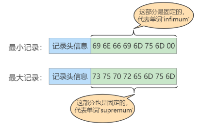

  这两条记录不是我们自己定义的记录，所以它们并不存放在页的User Records部分，他们被单独放在一个称为Infimum + Supremum的部分，如图所示：

  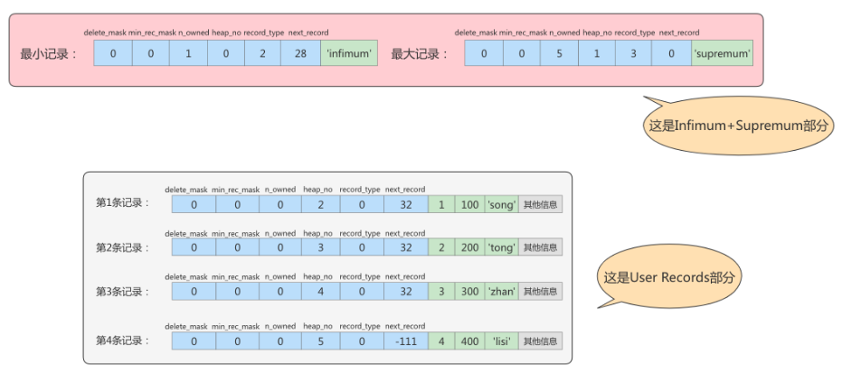


- Free Space

  我们自己存储的记录会按照指定的行格式存储到User Records部分。但是在一开始生成页的时候，其实并没有User Records这个部分，每当我们插入一条记录，都会从Free Space部分，也就是尚未使用的存储空间中申请一个记录大小的空间划分到User Records部分，当Free Space部分的空间全部被User Records部分替代掉之后，也就意味着这个页使用完了，如果还有新的记录插入的话，就需要去申请新的页了。

  


- User Records

  User Records中的这些记录按照指定的行格式一条一条摆在User Records部分，相互之间形成单链表。

  用户记录里的一条条数据如何记录？这里需要讲讲记录行格式的记录头信息：

  

### 第三部分：Page Directory (页目录) 和 Page Header (页面头部)


- Page Directory

  为什么需要页目录？

  在页中，记录是以单向链表的形式进行存储的。单向链表的特点就是插入、删除非常方便，但是检索效率不高，最差的情况下需要遍历链表上的所有节点才能完成检索。因此在页结构中专门设计了页目录这个模块，专门给记录做一个目录，通过二分查找法的方式进行检索，提升效率。

  需求：根据主键值查找页中的某条记录，如何实现快速查找呢？

  SELECT * FROM page_demo WHERE c1 = 3;

  方式1：顺序查找

  从Infimum记录（最小记录）开始，沿着链表一直往后找，总有一天会找到（或者找不到），在找的时候还能投机取巧，因为链表中各个记录的值是按照从小到大顺序排列的，所以当链表的某个节点代表的记录的主键值大于你想要查找的主键值时，你就可以停止查找了，因为该节点后边的节点的主键值依次递增。

  如果一个页中存储了非常多的记录，这么查找性能很差。

  方式2：使用页目录，二分法查找

  1. 将所有的记录分成几个组，这些记录包括最小记录和最大记录，但不包括标记为“已删除”的记录。

  2. 第 1 组，也就是最小记录所在的分组只有 1 个记录；

    最后一组，就是最大记录所在的分组，会有 1-8 条记录；

    其余的组记录数量在 4-8 条之间。

  这样做的好处是，除了第 1 组（最小记录所在组）以外，其余组的记录数会尽量平分。

  3. 在每个组中最后一条记录的头信息中会存储该组一共有多少条记录，作为 n_owned 字段。

  4. 页目录用来存储每组最后一条记录的地址偏移量，这些地址偏移量会按照先后顺序存储起来，每组的地址偏移量也被称之为槽（slot），每个槽相当于指针指向了不同组的最后一个记录。

  举例1：

  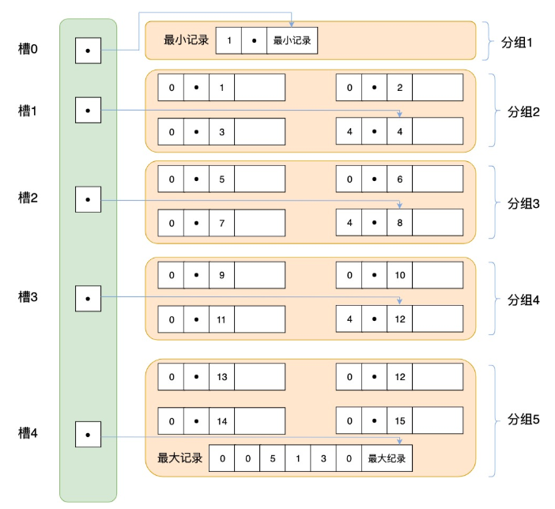

  举例2：

  现在的page_demo表中正常的记录共有6条，InnoDB会把它们分成两组，第一组中只有一个最小记录，第二组中是剩余的5条记录。如下图：

  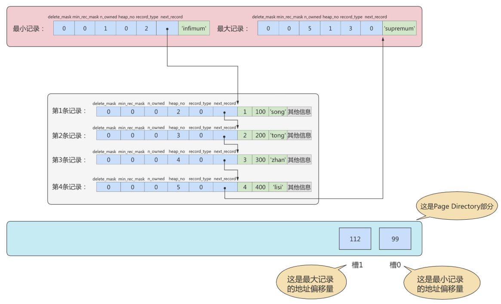

  从这个图中我们需要注意这么几点：

  - 现在页目录部分中有两个槽，也就意味着我们的记录被分成了两个组，槽1中的值是112，代表最大记录的地址偏移量（就是从页面的0字节开始数，数112个字节）；槽0中的值是99，代表最小记录的地址偏移量。

  - 注意最小和最大记录的头信息中的n_owned属性

  - 最小记录的n_owned值为1，这就代表着以最小记录结尾的这个分组中只有1条记录，也就是最小记录本身。

  - 最大记录的n_owned值为5，这就代表着以最大记录结尾的这个分组中只有5条记录，包括最大记录本身还有我们自己插入的4条记录。

  用箭头指向的方式替代数字，这样更易于我们理解，修改后如下：

  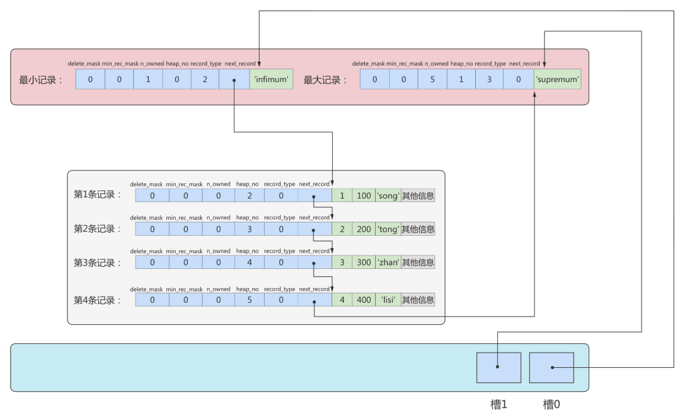

  再换个角度看一下：（单纯从逻辑上看一下这些记录和页目录的关系）

  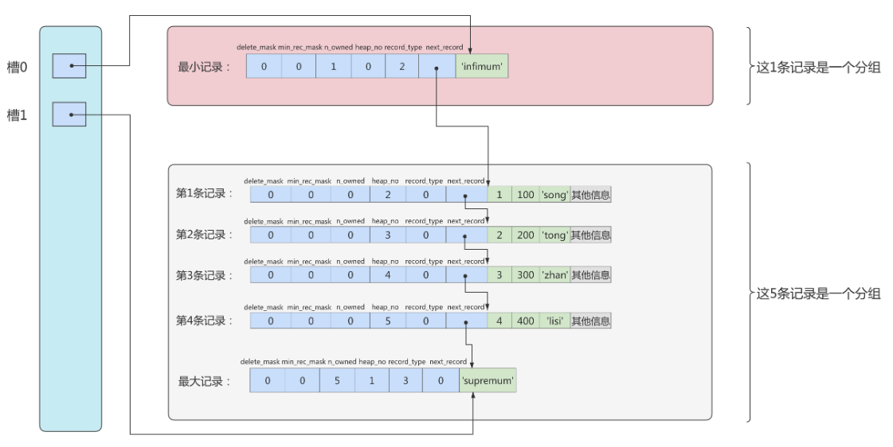

  > 页目录分组的个数如何确定？
  >
  > 为什么最小记录的n_owned值为1，而最大记录的n_owned值为5呢？
  >
  > InnoDB规定：对于最小记录所在的分组只能有1条记录，最大记录所在的分组拥有的记录条数只能在1~8条之间，剩下的分组中记录的条数范围只能在是 4~8 条之间。
  >
  > 分组是按照下边的步骤进行的：
  >
  > - 初始情况下一个数据页里只有最小记录和最大记录两条记录，它们分属于两个分组。
  >
  > - 之后每插入一条记录，都会从页目录中找到主键值比本记录的主键值大并且差值最小的槽，然后把该槽对应的记录的n_owned值加1，表示本组内又添加了一条记录，直到该组中的记录数等于8个。
  >
  > - 在一个组中的记录数等于8个后再插入一条记录时，会将组中的记录拆分成两个组，一个组中4条记录，另一个5条记录。这个过程会在页目录中新增一个槽来记录这个新增分组中最大的那条记录的偏移量。
  >
  > 
  >
  > 页目录下如何快速查找记录？
  >
  > 现在向page_demo表中添加更多的数据。如下：
  >
  > INSERT INTO page_demo 
  >
  > VALUES
  >
  > (5, 500, 'zhou'), 
  >
  > (6, 600, 'chen'), 
  >
  > (7, 700, 'deng'), 
  >
  > (8, 800, 'yang'), 
  >
  > (9, 900, 'wang'), 
  >
  > (10, 1000, 'zhao'), 
  >
  > (11, 1100, 'qian'), 
  >
  > (12, 1200, 'feng'), 
  >
  > (13, 1300, 'tang'), 
  >
  > (14, 1400, 'ding'), 
  >
  > (15, 1500, 'jing'), 
  >
  > (16, 1600, 'quan');
  >
  > 添加了12条记录，现在页里一共有18条记录了（包括最小和最大记录），这些记录被分成了5个组，如图所示：
  >
  > 
  >
  > 这里只保留了16条记录的记录头信息中的n_owned和next_record属性，省略了各个记录之间的箭头。
  >
  > 现在看怎么从这个页目录中查找记录。因为各个槽代表的记录的主键值都是从小到大排序的，所以我们可以使用二分法来进行快速查找。5个槽的编号分别是：0、1、2、3、4，所以初始情况下最低的槽就是low=0，最高的槽就是high=4。比方说我们想找主键值为6的记录，过程是这样的：
  >
  > 1. 计算中间槽的位置：(0+4)/2=2，所以查看槽2对应记录的主键值为8，又因为8 > 6，所以设置high=2，low保持不变。
  >
  > 2. 重新计算中间槽的位置：(0+2)/2=1，所以查看槽1对应的主键值为4，又因为4 
  >
  > 3. 因为high - low的值为1，所以确定主键值为6的记录在槽2对应的组中。此刻我们需要找到槽2中主键值最小的那条记录，然后沿着单向链表遍历槽2中的记录。
  >
  > 但是我们前边又说过，每个槽对应的记录都是该组中主键值最大的记录，这里槽2对应的记录是主键值为8的记录，怎么定位一个组中最小的记录呢？别忘了各个槽都是挨着的，我们可以很轻易的拿到槽1对应的记录（主键值为4），该条记录的下一条记录就是槽2中主键值最小的记录，该记录的主键值为5。所以我们可以从这条主键值为5的记录出发，遍历槽2中的各条记录，直到找到主键值为6的那条记录即可。
  >
  > 由于一个组中包含的记录条数只能是1~8条，所以遍历一个组中的记录的代价是很小的。
  >
  > 小结：
  >
  > 在一个数据页中查找指定主键值的记录的过程分为两步：
  >
  > 1. 通过二分法确定该记录所在的槽，并找到该槽所在分组中主键值最小的那条记录。
  >
  > 2. 通过记录的next_record属性遍历该槽所在的组中的各个记录。

- Page Header

  为了能得到一个数据页中存储的记录的状态信息，比如本页中已经存储了多少条记录，第一条记录的地址是什么，页目录中存储了多少个槽等等，特意在页中定义了一个叫Page Header的部分，这个部分占用固定的56个字节，专门存储各种状态信息。

  


### 2.3 从数据库页的角度看B+树如何查询

一颗B+树按照字节类型可以分为两部分：

1. 叶子节点，B+ 树最底层的节点，节点的高度为0，存储行记录。
2. 非叶子节点，节点的高度大于0，存储索引键和页面指针，并不存储行记录本身。


当我们从页结构来理解 B+ 树的结构的时候，可以帮我们理解一些通过索引进行检索的原理：


## 3. InnoDB行格式 (或记录格式)


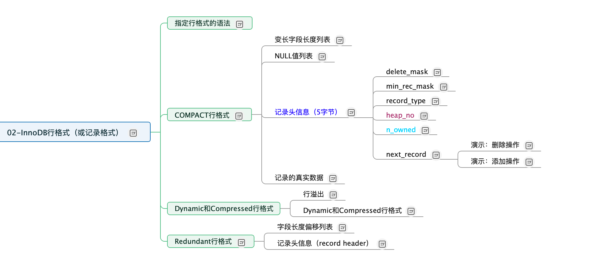

### 3.1 Compact行格式

在MySQL 5.1版本中，默认设置为Compact行格式。一条完整的记录其实可以被分为记录的额外信息和记录的真实数据两大部分。

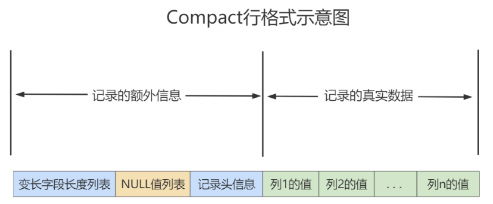

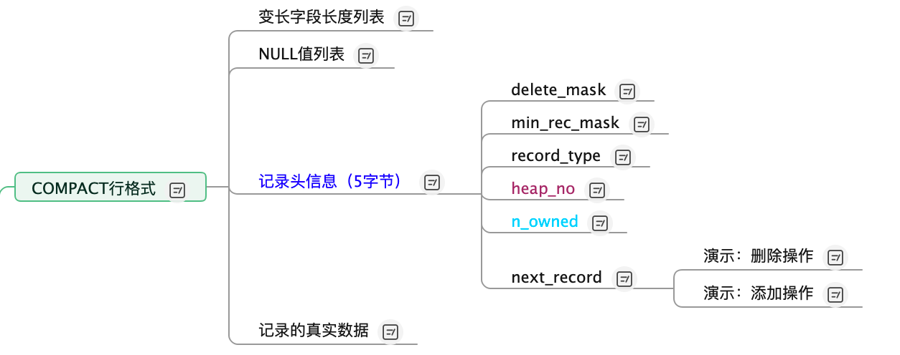

- 变长字段列表

  MySQL支持一些变长的数据类型，比如VARCHAR(M)、VARBINARY(M)、TEXT类型，BLOB类型，这些数据类型修饰列称为变长字段，变长字段中存储多少字节的数据不是固定的，所以我们在存储真实数据的时候需要顺便把这些数据占用的字节数也存起来。在Compact行格式中，把所有变长字段的真实数据占用的字节长度都存放在记录的开头部位，从而形成一个变长字段长度列表。

  注意：这里面存储的变长长度和字段顺序是反过来的。比如两个varchar字段在表结构的顺序是a(10)，b(15)。那么在变长字段长度列表中存储的长度顺序就是15，10，是反过来的。

  以record_test_table表中的第一条记录举例：因为record_test_table表的col1、col2、col4列都是VARCHAR(8)类型的，所以这三个列的值的长度都需要保存在记录开头处，注意record_test_table表中的各个列都使用的是ascii字符集（每个字符只需要1个字节来进行编码）。

  

  又因为这些长度值需要按照列的逆序存放，所以最后变长字段长度列表的字节串用十六进制表示的效果就是（各个字节之间实际上没有空格，用空格隔开只是方便理解）：

  06 04 08 

  

  把这个字节串组成的变长字段长度列表填入上边的示意图中的效果就是：

  

- NULL值列表

  Compact行格式会把可以为NULL的列统一管理起来，存在一个标记为NULL值列表中。如果表中没有允许存储 NULL 的列，则 NULL值列表也不存在了。

  为什么定义NULL值列表？

  之所以要存储NULL是因为数据都是需要对齐的，如果没有标注出来NULL值的位置，就有可能在查询数据的时候出现混乱。如果使用一个特定的符号放到相应的数据位表示空置的话，虽然能达到效果，但是这样很浪费空间，所以直接就在行数据得头部开辟出一块空间专门用来记录该行数据哪些是非空数据，哪些是空数据，格式如下：

  1. 二进制位的值为1时，代表该列的值为NULL。

  2. 二进制位的值为0时，代表该列的值不为NULL。

  例如：字段 a、b、c，其中a是主键，在某一行中存储的数依次是 a=1、b=null、c=2。那么Compact行格式中的NULL值列表中存储：01。第一个0表示c不为null，第二个1表示b是null。这里之所以没有a是因为数据库会自动跳过主键，因为主键肯定是非NULL且唯一的，在NULL值列表的数据中就会自动跳过主键。

  record_test_table的两条记录的NULL值列表就如下：

  第一条记录：

  

  第二条记录：

  

- 记录头信息

  mysql> CREATE TABLE page_demo(

    ->   c1 INT,

    ->   c2 INT,

    ->   c3 VARCHAR(10000),

    ->   PRIMARY KEY (c1)

    -> ) CHARSET=ascii ROW_FORMAT=Compact;

  Query OK, 0 rows affected (0.03 sec)

  这个表中记录的行格式示意图：

  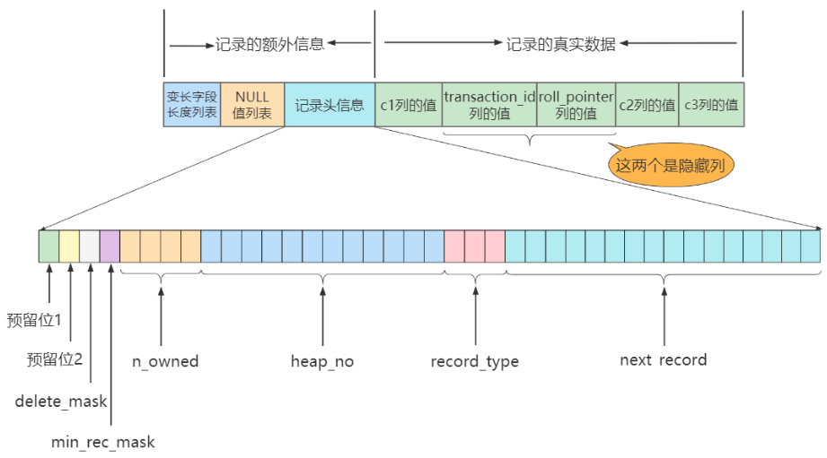

  这些记录头信息中各个属性如下：

  

  简化后的行格式示意图：

  

  插入数据：

  INSERT INTO page_demo 

  VALUES

  (1, 100, 'song'), 

  (2, 200, 'tong'), 

  (3, 300, 'zhan'), 

  (4, 400, 'lisi');

  图示如下：

  

> delete_mask：
>
> 这个属性标记着当前记录是否被删除，占用1个二进制位。
>
> - 值为0：代表记录并没有被删除
>
> - 值为1：代表记录被删除掉了
>
> 被删除的记录为什么还在页中存储呢？
>
> 你以为它删除了，可它还在真实的磁盘上。这些被删除的记录之所以不立即从磁盘上移除，是因为移除它们之后其他的记录在磁盘上需要重新排列，导致性能消耗。所以只是打一个删除标记而已，所有被删除掉的记录都会组成一个所谓的垃圾链表，在这个链表中的记录占用的空间称之为可重用空间，之后如果有新记录插入到表中的话，可能把这些被删除的记录占用的存储空间覆盖掉。
>
> 
>
> min_rec_mask：
>
> B+树的每层非叶子节点中的最小记录都会添加该标记，min_rec_mask值为1。
>
> 我们自己插入的四条记录的min_rec_mask值都是0，意味着它们都不是B+树的非叶子节点中的最小记录。
>
> 
>
> record_type：
>
> 这个属性表示当前记录的类型，一共有4种类型的记录：
>
>   0：表示普通记录
>
>   1：表示B+树非叶节点记录
>
>   2：表示最小记录
>
>   3：表示最大记录
>
> 从图中我们也可以看出来，我们自己插入的记录就是普通记录，它们的record_type值都是0，而最小记录和最大记录的record_type值分别为2和3。至于record_type为1的情况，我们在索引的数据结构章节讲过。
>
> 
>
> heap_no：
>
> 这个属性表示当前记录在本页中的位置。
>
> 从图中可以看出来，我们插入的4条记录在本页中的位置分别是：2、3、4、5。
>
> 怎么不见heap_no值为0和1的记录呢？
>
> MySQL会自动给每个页里加了两个记录，由于这两个记录并不是我们自己插入的，所以有时候也称为伪记录或者虚拟记录。这两个伪记录一个代表最小记录，一个代表最大记录。最小记录和最大记录的heap_no值分别是0和1，也就是说它们的位置最靠前。
>
> 
>
> n_owned：
>
> 页目录中每个组中最后一条记录的头信息中会存储该组一共有多少条记录，作为 n_owned 字段。
>
> 详情见page directory。
>
> 
>
> next_record：
>
> 记录头信息里该属性非常重要，它表示从当前记录的真实数据到下一条记录的真实数据的地址偏移量。
>
> 比如：第一条记录的next_record值为32，意味着从第一条记录的真实数据的地址处向后找32个字节便是下一条记录的真实数据。
>
> 注意，下一条记录指得并不是按照我们插入顺序的下一条记录，而是按照主键值由小到大的顺序的下一条记录。而且规定Infimum记录（也就是最小记录）的下一条记录就是本页中主键值最小的用户记录，而本页中主键值最大的用户记录的下一条记录就是 Supremum记录（也就是最大记录）。下图用箭头代替偏移量表示next_record。
>
> 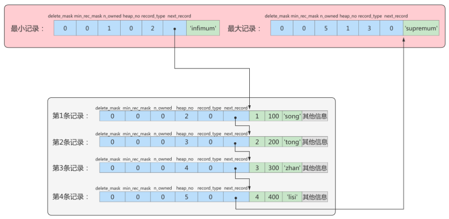


- 记录的真实数据

  记录的真实数据除了我们自己定义的列的数据以外，还会有三个隐藏列：

  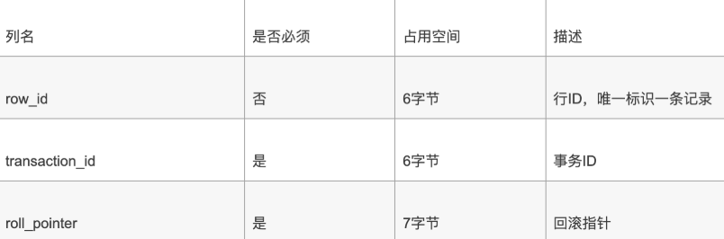

  实际上这几个列的真正名称其实是：DB_ROW_ID、DB_TRX_ID、DB_ROLL_PTR。

  - 一个表没有手动定义主键，则会选取一个Unique键作为主键，如果连Unique键都没有定义的话，则会为表默认添加一个名为row_id的隐藏列作为主键。所以row_id是在没有自定义主键以及Unique键的情况下才会存在的。

  - 事务ID和回滚指针在后面的《第14章_MySQL事务日志》章节中讲解。

  举例：分析Compact行记录的内部结构：

  CREATE TABLE mytest(

  col1 VARCHAR(10),

  col2 VARCHAR(10),

  col3 CHAR(10),

  col4 VARCHAR(10)

  )ENGINE=INNODB CHARSET=LATIN1 ROW_FORMAT=COMPACT;

  INSERT INTO mytest

  VALUES('a','bb','bb','ccc');

  INSERT INTO mytest

  VALUES('d','ee','ee','fff');

  INSERT INTO mytest

  VALUES('d',NULL,NULL,'fff');

  通过程序UltraEdit打开表空间文件mytest.ibd这个二进制文件。内容如下：

  \------------------------------------------------------------------------------------------

  0000c070 73 75 70 72 65 6d 75 6d 03 02 01 0000 00 10 00|supremum........|

  0000c080 2c 00 00 00 2b 68 0000 00 00 00 06 0580 00 00|,...+h..........|

  0000c090 00 32 01 1061 62 6262 62 20 20 20 20 20 20 20|.2..abbbb|

  0000c0a0 2063 63 63 03 02 01 00 00 00 18 00 2b 00 00 00|ccc........+...|

  0000c0b0 2b 68 01 00 00 00 00 06 06 80 00 00 00 32 01 10|+h...........2..|

  0000c0c0 64 65 65 65 65 20 20 20 20 20 20 20 20 66 66 66|deeeefff|

  0000c0d0 03 010600 00 20 ff 9800 00 00 2b 68 0200 00|..........+h...|

  0000c0e0 00 00 06 0780 00 00 00 32 01 106466 66 66 00|........2..dfff.|

  \------------------------------------------------------------------------------------------

  该行记录从0000c078开始，若整理一下，相信大家会有更好的理解：

  \---------------------------------------------------------------------

  03 02 01           /*变长字段长度列表，逆序*/

  00               /*NULL标志位，第一行没有NULL值*/

  00 00 10 00 2c      /*Record Header，固定5字节长度*/

  00 00 00 2b 68 00    /*RowID InnoDB自动创建，6字节*/

  00 00 00 00 06 05    /*TransactionID*/

  80 00 00 00 32 01 10  /*Roll Pointer*/

  61                /*列1数据'a'*/

  62 62             /*列2数据'bb'*/

  62 62 20 20 20 20 20 20 20 20/*列3数据'bb'*/

  63 63 63           /*列4数据'ccc'*/

  \---------------------------------------------------------------------

  注意1：InnoDB每行有隐藏列TransactionID和Roll Pointer。:

  注意2：固定长度CHAR字段在未能完全占用其长度空间时，会用0x20来进行填充。

  接着再来分析下Record Header的最后两个字节，这两个字节代表next_recorder，0x2c代表下一个记录的偏移量，即当前记录的位置加上偏移量0x2c就是下条记录的起始位置。

  第二行将不做整理，除了RowID不同外，它和第一行大同小异，现在来分析有NULL值的第三行：

  \---------------------------------------------------------------------

  03 01                /*变长字段长度列表，逆序*/

  06                  /*NULL标志位，第三行有NULL值*/

  00 00 20 ff 98         /*Record Header*/

  00 00 00 2b 68 02      /*RowID*/

  00 00 00 00 06 07      /*TransactionID*/

  80 00 00 00 32 01 10    /*Roll Pointer*/

  64                  /*列1数据'd'*/

  66 66 66             /*列4数据'fff'*/

  \---------------------------------------------------------------------

  第三行有NULL值，因此NULL标志位不再是00而是06，转换成二进制为00000110，为1的值代表第2列和第3列的数据为NULL。在其后存储列数据的部分，用户会发现没有存储NULL列，而只存储了第1列和第4列非NULL的值。

  因此这个例子很好地说明了：不管是CHAR类型还是VARCHAR类型，在compact格式下NULL值都不占用任何存储空间。


### 3.2 Dynamic和Compressed行格式

行溢出：

InnoDB存储引擎可以将一条记录中的某些数据存储在真正的数据页面之外。

很多DBA喜欢MySQL数据库提供的VARCHAR(M)类型，认为可以存放65535字节。这是真的吗？如果我们使用 ascii字符集的话，一个字符就代表一个字节，我们看看VARCHAR(65535)是否可用。

CREATE TABLE varchar_size_demo(

 c VARCHAR(65535)

 ) CHARSET=ascii ROW_FORMAT=Compact;

结果如下：

ERROR 1118 (42000): Row size too large. The maximum row size for the used table type, not counting BLOBs, is 65535. This includes storage overhead, check the manual. You have to change some columns to TEXT or BLOBs

报错信息表达的意思是：MySQL对一条记录占用的最大存储空间是有限制的，除BLOB或者TEXT类型的列之外， 其他所有的列（不包括隐藏列和记录头信息）占用的字节长度加起来不能超过65535个字节。

这个65535个字节除了列本身的数据之外，还包括一些其他的数据，以Compact行格式为例，比如说我们为了存储一个VARCHAR(M)类型的列，除了真实数据占有空间以外，还需要记录的额外信息。

如果该VARCHAR类型的列没有NOT NULL属性，那最多只能存储65532个字节的数据，因为变长字段的长度占用 2个字节，NULL值标识需要占用1个字节。

CREATE TABLE varchar_size_demo(

  c VARCHAR(65532)

) CHARSET=ascii ROW_FORMAT=Compact;

\#如果有not null属性，那么就不需要NULL值标识，也就可以多存储一个字节，即65533个字节

CREATE TABLE varchar_size_demo( 

 c VARCHAR(65533) not null

) CHARSET=ascii ROW_FORMAT=Compact; 

通过上面的案例，我们可以知道一个页的大小一般是16KB，也就是16384字节，而一个VARCHAR(M)类型的列就最多可以存储65533个字节，这样就可能出现一个页存放不了一条记录，这种现象称为行溢出。 

在Compact和Reduntant行格式中，对于占用存储空间非常大的列，在记录的真实数据处只会存储该列的一部分数据，把剩余的数据分散存储在几个其他的页中进行分页存储，然后记录的真实数据处用20个字节存储指向这些页的地址（当然这20个字节中还包括这些分散在其他页面中的数据的占用的字节数），从而可以找到剩余数据所在的页。

这称为页的扩展，举例如下：

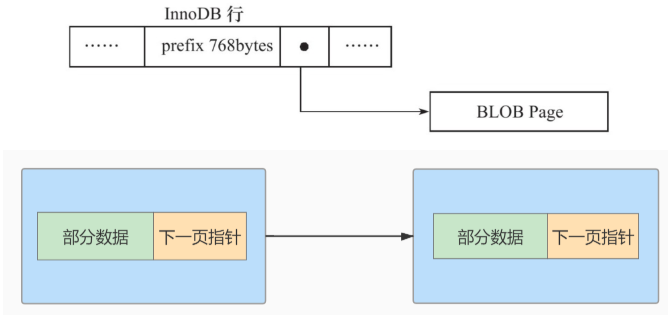


在MySQL 8.0中，默认行格式就是Dynamic，Dynamic、Compressed行格式和Compact行格式挺像，只不过在处理行溢出数据时有分歧：

- Compressed和Dynamic两种记录格式对于存放在BLOB中的数据采用了完全的行溢出的方式。如图，在数据页中只存放20个字节的指针（溢出页的地址），实际的数据都存放在Off Page（溢出页）中。

- Compact和Redundant两种格式会在记录的真实数据处存储一部分数据（存放768个前缀字节）。

Compressed行记录格式的另一个功能就是，存储在其中的行数据会以zlib的算法进行压缩，因此对于BLOB、TEXT、VARCHAR这类大长度类型的数据能够进行非常有效的存储。


## 4. 区、段与碎片区

### 4.1 为什么要有区？


### 4.2 为什么要有段？


### 4.3 为什么要有碎片区？


### 4.4 区的分类

区大体上可以分为4种类型：

* 空闲的区 (FREE) : 现在还没有用到这个区中的任何页面。
* 有剩余空间的碎片区 (FREE_FRAG)：表示碎片区中还有可用的页面。
* 没有剩余空间的碎片区 (FULL_FRAG)：表示碎片区中的所有页面都被使用，没有空闲页面。
* 附属于某个段的区 (FSEG)：每一个索引都可以分为叶子节点段和非叶子节点段。

处于FREE、FREE_FRAG 以及 FULL_FRAG 这三种状态的区都是独立的，直属于表空间。而处于 FSEG 状态的区是附属于某个段的。

> 如果把表空间比作是一个集团军，段就相当于师，区就相当于团。一般的团都是隶属于某个师的，就像是处于 FSEG 的区全部隶属于某个段，而处于 FREE、FREE_FRAG 以及 FULL_FRAG 这三种状态的区却直接隶属于表空间，就像独立团直接听命于军部一样。

## 5. 表空间


### 5.1 独立表空间

独立表空间，即每张表有一个独立的表空间，也就是数据和索引信息都会保存在自己的表空间中。独立的表空间 (即：单表) 可以在不同的数据库之间进行 `迁移`。

空间可以回收 (DROP TABLE 操作可自动回收表空间；其他情况，表空间不能自己回收) 。如果对于统计分析或是日志表，删除大量数据后可以通过：alter table TableName engine=innodb; 回收不用的空间。对于使用独立表空间的表，不管怎么删除，表空间的碎片不会太严重的影响性能，而且还有机会处理。

**独立表空间结构**

独立表空间由段、区、页组成。

**真实表空间对应的文件大小**

我们到数据目录里看，会发现一个新建的表对应的 .ibd 文件只占用了 96K，才6个页面大小 (MySQL5.7中)，这是因为一开始表空间占用的空间很小，因为表里边都没有数据。不过别忘了这些 .ibd 文件是自扩展的，随着表中数据的增多，表空间对应的文件也逐渐增大。

**查看 InnoDB 的表空间类型：**

```mysql
show variables like 'innodb_file_per_table'
```

你能看到 innodb_file_per_table=ON, 这就意味着每张表都会单词保存一个 .ibd 文件。

### 5.2 系统表空间

系统表空间的结构和独立表空间基本类似，只不过由于整个MySQL进程只有一个系统表空间，在系统表空间中会额外记录一些有关整个系统信息的页面，这部分是独立表空间中没有的。

**InnoDB数据字典**


这些数据并不是我们使用 INSERT 语句插入的用户数据，实际上是为了更好的管理我们这些用户数据而不得以引入的一些额外数据，这些数据页称为 元数据。InnoDB 存储引擎特意定义了一些列的 内部系统表 (internal system table) 来记录这些元数据：


这些系统表也称为 `数据字典`，它们都是以 B+ 树的形式保存在系统表空间的某个页面中。其中 `SYS_TABLES、SYS_COLUMNS、SYS_INDEXES、SYS_FIELDS` 这四个表尤其重要，称之为基本系统表 (basic system tables) ，我们先看看这4个表的结构：


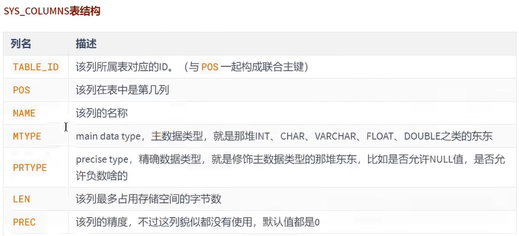


注意：用户不能直接访问 InnoDB 的这些内部系统表，除非你直接去解析系统表空间对应文件系统上的文件。不过考虑到查看这些表的内容可能有助于大家分析问题，所以在系统数据库 `information_schema` 中提供了一些以 `innodb_sys` 开头的表:

```mysql
USE information_schema;
```

```mysql
SHOW TABLES LIKE 'innodb_sys%';
```

在 `information_scheme` 数据库中的这些以 `INNODB_SYS` 开头的表并不是真正的内部系统表 (内部系统表就是我们上边以 `SYS` 开头的那些表)，而是在存储引擎启动时读取这些以 `SYS` 开头的系统表，然后填充到这些以 `INNODB_SYS` 开头的表中。以 `INNODB_SYS` 开头的表和以 `SYS` 开头的表中的字段并不完全一样，但仅供大家参考已经足矣。

## 附录：数据页加载的三种方式

InnoDB从磁盘中读取数据 `最小单位` 是数据页。而你想得到的 id = xxx 的数据，就是这个数据页众多行中的一行。

对于MySQL存放的数据，逻辑概念上我们称之为表，在磁盘等物理层面而言是按 `数据页` 形式进行存放的，当其加载到 MySQL 中我们称之为 `缓存页`。

如果缓冲池没有该页数据，那么缓冲池有以下三种读取数据的方式，每种方式的读取速率是不同的：

**1. 内存读取**

如果该数据存在于内存中，基本上执行时间在 1ms 左右，效率还是很高的。


**2. 随机读取**


**3. 顺序读取**


