## 一、简单理解

### 1、tcp三次握手

TCP/IP协议是传输层的一个面向连接的安全可靠的传输协议，三次握手的机制是保证能建立一个安全可靠的连接。那么第一次握手是由客户端发起，客户端会向服务端发送一个报文，在报文里SYN=1，当服务端收到这个报文之后，就知道客户端要和自己发起一个新的连接，于是，服务端就会向客户端发送一个确认消息报，这个消息报文ACK=1，以上两次握手之后，对于客户端来说已经知道，自己既能给服务端发消息，也能收到服务端发的消息，但是对服务端来说，两次握手是不够的，因为，到目前为止，服务端只知道一件事，客户端发给我的消息我能收到，我发给客户端的消息能不能收到？还不能确认，所以还需要进行第三次握手，当客户端收到服务端发来的确认消息报文之后，还要继续给服务端发消息确认，也是一个ACK=1的确认消息报，通过以上三次连接，不管是客户端还是服务端，都能互相确认可以收到对法发送的消息，那么这个连接可以被安全的建立。

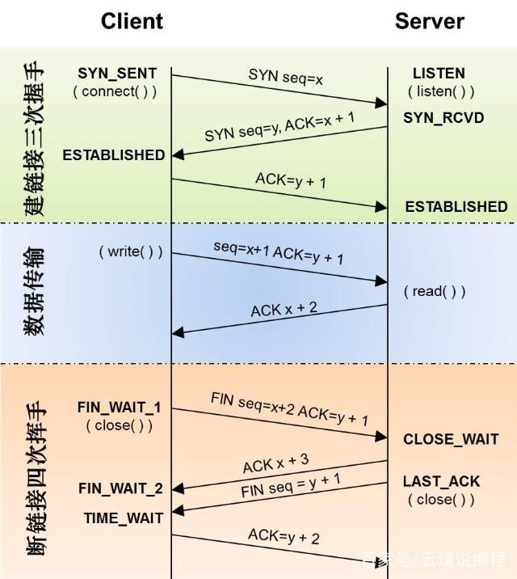

### 2、四次挥手

四次挥手也是客户端发起的，客户端会发送一个报文，报文中FIN=1，当服务端收到这个报文之后，就知道了客户端想要和自己断开连接，但此时服务端不一定做好准备，因为当客户端发起断开连接的报文的时候，服务端有可能还有未发送完的报文消息需要继续发送，所以此时服务端只能告诉客户端我知道你要和我断开连接了，但是我这里可能还没做好准备，需要等我一下，等会我会告诉你，于是，发完这个消息确认报之后，稍过片刻服务端继续发送一个断开连接的报文，FIN=1，表明服务端已经做好断开连接的准备，那么，当这个消息发给客户端的时候，客户端同样需要继续发送一个消息确认的报文，那么通过这四次的沟通和连接，双方都已经知道对方做好了断开的准备。

## 二、深入理解

### 1、TCP报文格式

tcp报文格式：

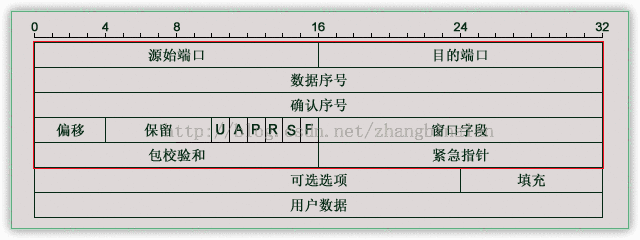

固定首部长度为20字节,可变部分0~40字节,各字段解释：

1. 源端口，16bits，范围0~65525。
2. 目的端口，16bits，范围同上。
3. sequence number： 数据序号，32bits，TCP 连接中传送的数据流中的每一个字节都编上一个序号。序号字段的值则指的是本报文段所发送的数据的第一个字节的序号。
4. acknoledgement number： 确认号，32bits，期望收到对方的下一个报文段的数据的第一个字节的序号。
5. 数据偏移，4bits，单位为4字节，它指出报文数据距TCP报头的起始处有多远(TCP报文头长度)。
6. 保留字段 6bits，保留今后使用，目前置0处理。
7. URG：紧急比特，1bit，当 URG=1 时，表明紧急指针字段有效。它告诉系统此报文段中有紧急数据，应尽快传送(相当于高优先级的数据)
   ACK：确认比特，1bit，只有当 ACK=1时确认号字段才有效。当 ACK=0 时，确认号无效
   PSH：推送比特，1bit，接收方 TCP 收到推送比特置1的报文段，就尽快地交付给接收应用进程，而不再等到整个缓存都填满了后再向上交付
   RST：复位比特，1bit，当RST=1时，表明TCP连接中出现严重差错(如由于主机崩溃或其他原因)，必须释放连接，然后再重新建立运输连接
   SYN：同步比特，1bit，同步比特 SYN 置为 1，就表示这是一个连接请求或连接接受报文
   FIN：终止比特，1bit，用来释放一个连接。当FIN=1 时，表明此报文段的发送端的数据已发送完毕，并要求释放运输连接
8. 窗口大小，16bits，窗口字段用来控制对方发送的数据量，单位为字节。TCP 连接的一端根据设置的缓存空间大小确定自己的接收窗口大小，然后通知对方以确定对方的发送窗口的上限。
9. 检验和，16bits，检验和字段检验的范围包括首部和数据这两部分。在计算检验和时，要在 TCP 报文段的前面加上 12 字节的伪首部。
10. 紧急指针字段，16bits，紧急指针指出在本报文段中的紧急数据的最后一个字节的序号。
11. 选项字段，长度可变。TCP首部可以有多达40字节的可选信息，用于把附加信息传递给终点，或用来对齐其它选项。 这部分最多包含40字节，因为TCP头部最长是60字节（其中还包含前面讨论的20字节的固定部分）
    选项的第一个字段kind说明选项的类型。有的TCP选项没有后面两个字段，仅包含1字节的kind字段。第二个字段length（如果有的话）指定该选项的总长度，该长度包括kind字段和length字段占据的2字节。第三个字段info（如果有的话）是选项的具体信息. kind=0是选项表结束选项
    kind=1是空操作（nop）选项，没有特殊含义，一般用于将TCP选项的总长度填充为4字节的整数倍
    kind=2是最大报文段长度选项,TCP连接初始化时，通信双方使用该选项来协商最大报文段长度（Max Segment Size，MSS）。TCP模块通常将MSS设置为（MTU-40）字节（减掉的这40字节包括20字节的TCP头部和20字节的IP头部）。这样携带TCP报文段的IP数据报的长度就不会超过MTU（假设TCP头部和IP头部都不包含选项字段，并且这也是一般情况），从而避免本机发生IP分片。对以太网而言，MSS值是1460（1500-40）字节。

### 2、TCP链接的状态

TCP连接生命周期的状态：

1. LISTEN 等待远程的TCP连接请求

2. SYN-SENT 发送了建立连接的请求，等待确认消息

3. SYN-RECIEVED 收到了对方建立连接的请求且发送了建立连接的请求（确认对方建立建立连接的请求）。等待对方确认自己发送的连接请求

4. ESTABLISHED 连接已经建立，可以正常进行数据传输

5. FIN-WAIT-1 等待对方确认刚刚发送的关闭连接的请求

6. FIN-WAIT-2 收到关闭连接请求的确认，等待对方发送关闭连接的请求

7. CLOSE-WAIT 确认了对方的关闭连接请求，等待本地用户关闭连接指令

8. LAST-ACK 被动关闭的一方，在CLOSE-WAIT状态下收到用户关闭连接的指令，发送关闭连接请求，等待确认

9. TIME-WAIT 主动关闭连接的一方收到对方发送的对方关闭连接请求的确认消息后,等待足够长的时间（2MSL）以确保对方接收到ACK包.最后回到CLOSED状态，释放网络资源

10. CLOSING 比较罕见的例外状态。正常情况下，发送FIN包后应该先收到（或同时收到）对方的ACK包，再收到对方的FIN包，而CLOSING状态表示发送FIN包后并没有收到对方的ACK包，却已收到了对方的FIN包。有两种情况可能导致这种状态：其一，如果双方几乎在同时关闭连接，那么就可能出现双方同时发送FIN包的情况；其二，如果ACK包丢失而对方的FIN包很快发出，也会出现FIN先于ACK到达

11. CLOSED 关闭状态

    

TCP的RFC793里面给的状态转换图：

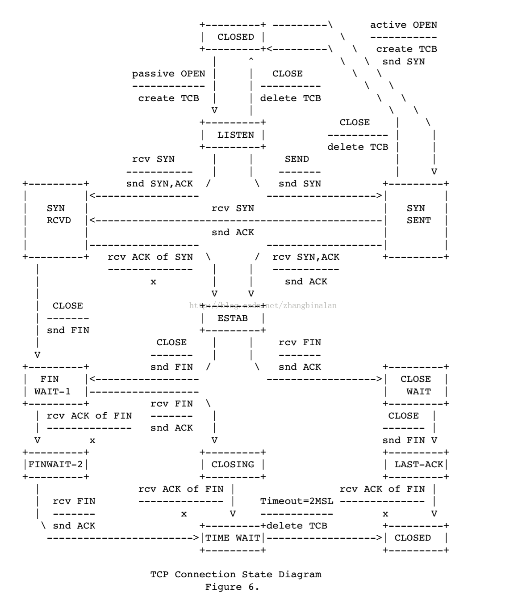

### 3、TCP建立连接

#### 三次握手

常见的建立连接的流程如下图，RFC文档给出了好几种情况下建立链接的流程图，这里只了解最简单的

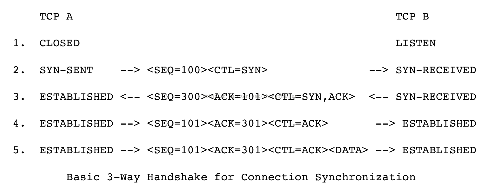

上面第四步的ACK报文不占用序列号。

#### 为什么要采用三次握手

为了防止已失效的连接请求报文段突然又传送到了服务端，因而产生错误
谢希仁版《计算机网络》中的例子是这样的，“已失效的连接请求报文段”的产生在这样一种情况下：client发出的第一个连接请求报文段并没有丢失，而是在某个网络结点长时间的滞留了，客户端重发了建立链接的请求并成功通信，连接释放，这之后最开始的建立链接的请求到达server。本来这是一个早已失效的报文段。但server收到此失效的连接请求报文段后，就误认为是client再次发出的一个新的连接请求。于是就向client发出确认报文段，同意建立连接。假设不采用“三次握手”，那么只要server发出确认，新的连接就建立了。由于现在client并没有发出建立连接的请求，因此不会理睬server的确认，也不会向server发送数据。但server却以为新的运输连接已经建立，并一直等待client发来数据。这样，server的很多资源就白白浪费掉了。采用“三次握手”的办法可以防止上述现象发生。例如刚才那种情况，client不会向server的确认发出确认。server由于收不到确认，就知道client并没有要求建立连接

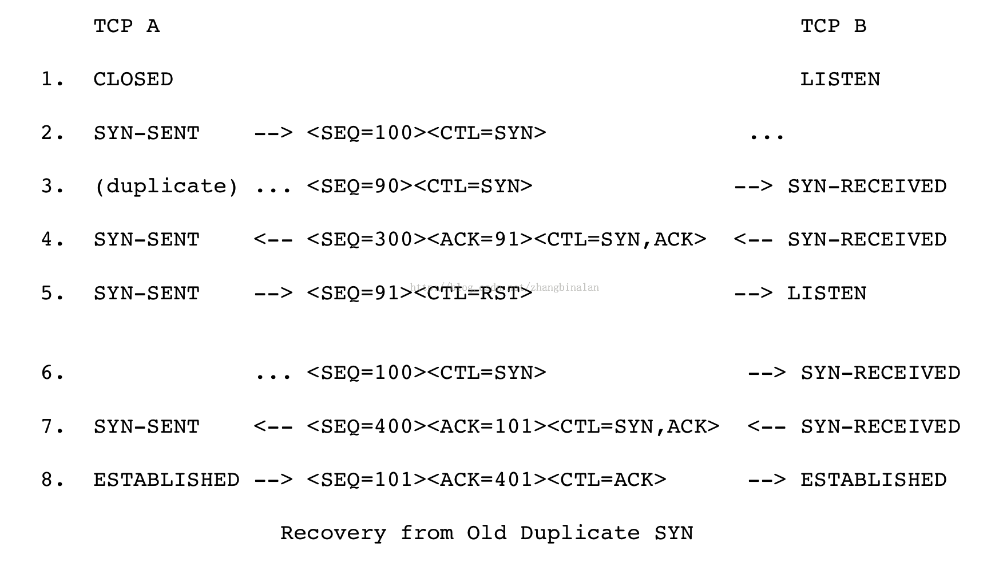

如上图，第三行，失效的SYN请求到达，TCP B无法区分是否失效的SYN，第四行会正常返回ACK；TCP A发现ACK报文的序列号不对，会返回RST报文（该报文的序列号取收到的ACK的序列号都是91）；TCP B收到RST后状态变为LISTEN；当第六行正常的SYN到达后，仍然可以正常建立连接

#### 创建TCB

何时创建TCB呢？
请求端发起SYN请求时，服务端收到SYN请求时建立

### 4、TCP断开连接

关闭一个连接意味着:"我没有数据要发送了",但是关闭的连接还可以接收数据直到对方也关闭了连接
TCP发现对方关闭了连接后，需要通知用户
由于TCP连 接是全双工的，因此每个方向都必须单独进行关闭

关闭连接的三种情况：

1. 本地用户发送CLOSE指令关闭连接 发送FIN报文给对方,状态变为FIN_WAIT_1;还可以接收数据,等待对方确认FIN报文;等待对方发送FIN；
2. 对方发送FIN报文 接收到对方发送的FIN报文,发送确认该FIN的ACK,进入CLOSE_WAIT状态; 通知本地用户,如果本地用户发送CLOSE指令,发送FIN报文,进入LAST_ACK状态,等待确认FIN报文,如果收到ACK报文删除连接,如果没有收到，会通知用户;
3. 双方同时关闭

常见关闭连接的流程： 

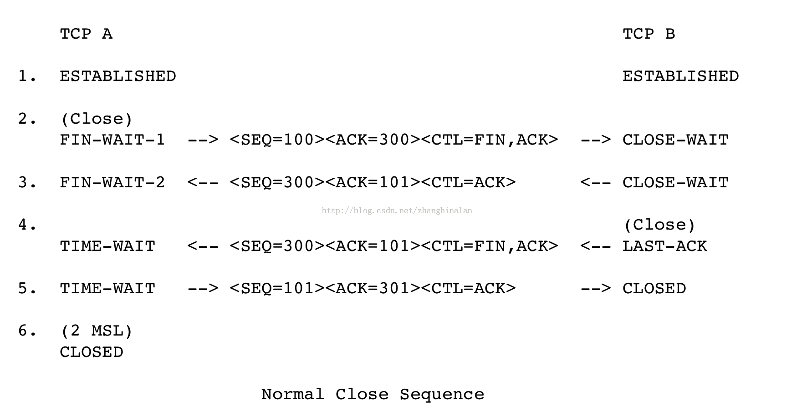

#### 为什么建立连接协议是三次握手，而关闭连接却是四次握手

这是因为服务端的LISTEN状态下的SOCKET当收到SYN报文的建连请求后，它可以把ACK和SYN（ACK起应答作用，而SYN起同步作用）放在一个报文里来发送。但关闭连接时，当收到对方的FIN报文通知时，它仅仅表示对方没有数据发送给你了；但未必你所有的数据都全部发送给对方了，所以你可以未必会马上会关闭SOCKET,也即你可能还需要发送一些数据给对方之后，再发送FIN报文给对方来表示你同意现在可以关闭连接了，所以它这里的ACK报文和FIN报文多数情况下都是分开发送的

#### 为什么TIME_WAIT状态还需要等2MSL后才能返回到CLOSED状态

什么是2MSL？MSL即Maximum Segment Lifetime，也就是报文最大生存时间。2MSL也就是这个时间的2倍，当TCP连接完成四个报文段的交换时，主动关闭的一方将继续等待一定时间(2-4分钟)，即使两端的应用程序结束
为什么需要这个2MSL呢?
虽然双方都同意关闭连接了，而且握手的4个报文也都协调和发送完毕，按理可以直接回到CLOSED状态（就好比从SYN_SEND状态到ESTABLISH状态那样）；但是因为我们必须要假想网络是不可靠的，你无法保证你最后发送的ACK报文会一定被对方收到，因此对方处于LAST_ACK状态下的SOCKET可能会因为超时未收到ACK报文，而重发FIN报文，所以这个TIME_WAIT状态的作用就是用来重发可能丢失的ACK报文
当某个连接的一端处于TIME_WAIT状态时，该连接将不能再被使用。事实上，对于我们比较有现实意义的是，这个端口将不能再被使用。某个端口处于TIME_WAIT状态(其实应该是这个连接)时，这意味着这个TCP连接并没有断开(完全断开)，那么，如果你bind这个端口，就会失败

#### TCB的删除

状态变为CLOSED，删除TCB

### 5、TCP流量控制

#### 利用滑动窗口实现流量控制

如果发送方把数据发送得过快，接收方可能会来不及接收，这就会造成数据的丢失
所谓流量控制就是让发送方的发送速率不要太快，要让接收方来得及接收.利用滑动窗口机制可以很方便地在TCP连接上实现对发送方的流量控制
设A向B发送数据。在连接建立时，B告诉了A：“我的接收窗口是 rwnd = 400 ”(这里的 rwnd 表示 receiver window) 。因此，发送方的发送窗口不能超过接收方给出的接收窗口的数值。请注意，TCP的窗口单位是字节，不是报文段。TCP连接建立时的窗口协商过程在图中没有显示出来。再设每一个报文段为100字节长，而数据报文段序号的初始值设为1。大写ACK表示首部中的确认位ACK，小写ack表示确认字段的值ack

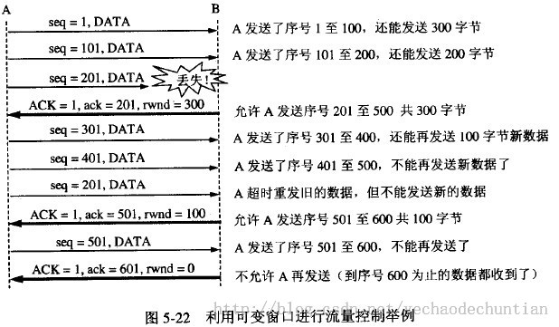

从图中可以看出，B进行了三次流量控制。第一次把窗口减少到 rwnd = 300 ，第二次又减到了 rwnd = 100 ，最后减到 rwnd = 0 ，即不允许发送方再发送数据了。这种使发送方暂停发送的状态将持续到主机B重新发出一个新的窗口值为止。B向A发送的三个报文段都设置了 ACK = 1 ，只有在ACK=1时确认号字段才有意义。 TCP为每一个连接设有一个持续计时器(persistence timer)。只要TCP连接的一方收到对方的零窗口通知，就启动持续计时器。若持续计时器设置的时间到期，就发送一个零窗口控测报文段（携1字节的数据），那么收到这个报文段的一方就重新设置持续计时器。

### 6、TCP的拥塞控制

#### 拥塞控制与流量控制

拥塞控制：防止过多的数据注入到网络中，这样可以使网络中的路由器或链路不致过载。拥塞控制所要做的都有一个前提：网络能够承受现有的网络负荷。拥塞控制是一个全局性的过程，涉及到所有的主机、路由器，以及与降低网络传输性能有关的所有因素

流量控制：指点对点通信量的控制，是端到端正的问题。流量控制所要做的就是抑制发送端发送数据的速率，以便使接收端来得及接收

拥塞控制代价：需要获得网络内部流量分布的信息。在实施拥塞控制之前，还需要在结点之间交换信息和各种命令，以便选择控制的策略和实施控制。这样就产生了额外的开销。拥塞控制还需要将一些资源分配给各个用户单独使用，使得网络资源不能更好地实现共享。

#### 几种拥塞控制方法

慢开始( slow-start )、拥塞避免( congestion avoidance )、快重传( fast retransmit )和快恢复( fast recovery )。

##### 慢开始和拥塞避免

发送方维持一个拥塞窗口 cwnd ( congestion window )的状态变量。拥塞窗口的大小取决于网络的拥塞程度，并且动态地在变化。发送方让自己的发送窗口等于拥塞
发送方控制拥塞窗口的原则是：只要网络没有出现拥塞，拥塞窗口就再增大一些，以便把更多的分组发送出去。但只要网络出现拥塞，拥塞窗口就减小一些，以减少注入到网络中的分组数

1. 慢开始算法
   慢开始算法：当主机开始发送数据时，如果立即所大量数据字节注入到网络，那么就有可能引起网络拥塞，因为现在并不清楚网络的负荷情况。因此，较好的方法是先探测一下，即由小到大逐渐增大发送窗口，也就是说，由小到大逐渐增大拥塞窗口数值。通常在刚刚开始发送报文段时，先把拥塞窗口 cwnd 设置为一个最大报文段MSS的数值。而在每收到一个对新的报文段的确认后，把拥塞窗口增加至多一个MSS的数值。用这样的方法逐步增大发送方的拥塞窗口 cwnd ，可以使分组注入到网络的速率更加合理

   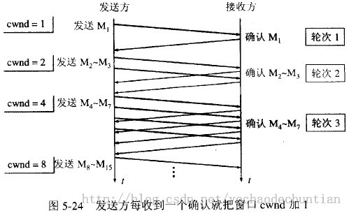

   每经过一个传输轮次，拥塞窗口 cwnd 就加倍。一个传输轮次所经历的时间其实就是往返时间RTT。不过"传输轮次”更加强调：把拥塞窗口cwnd所允许发送的报文段都连续发送出去，并收到了对已发送的最后一个字节的确认
   另，慢开始的“慢"并不是指cwnd的增长速率慢，而是指在TCP开始发送报文段时先设置cwnd=1，使得发送方在开始时只发送一个报文段（目的是试探一下网络的拥塞情况），然后再逐渐增大cwnd
   为了防止拥塞窗口cwnd增长过大引起网络拥塞，还需要设置一个慢开始门限ssthresh状态变量（如何设置ssthresh)。慢开始门限ssthresh的用法如下： 当 cwnd < ssthresh 时，使用上述的慢开始算法
   当 cwnd > ssthresh 时，停止使用慢开始算法而改用拥塞避免算法
   当 cwnd = ssthresh 时，既可使用慢开始算法，也可使用拥塞控制避免算法

2. 拥塞避免算法
   让拥塞窗口cwnd缓慢地增大，即每经过一个往返时间RTT就把发送方的拥塞窗口cwnd加1，而不是加倍。这样拥塞窗口cwnd按线性规律缓慢增长，比慢开始算法的拥塞窗口增长速率缓慢得多
   无论在慢开始阶段还是在拥塞避免阶段，只要发送方判断网络出现拥塞（其根据就是没有收到确认），就要把慢开始门限ssthresh设置为出现拥塞时的发送方窗口值的一半（但不能小于2）。然后把拥塞窗口cwnd重新设置为1，执行慢开始算法。这样做的目的就是要迅速减少主机发送到网络中的分组数，使得发生拥塞的路由器有足够时间把队列中积压的分组处理完毕
   如下图，用具体数值说明了上述拥塞控制的过程。现在发送窗口的大小和拥塞窗口一样大 

   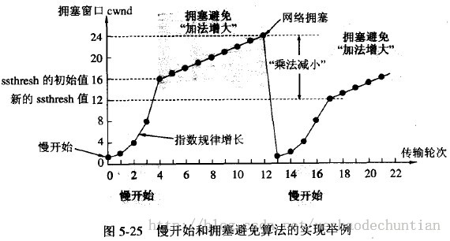

   1:当TCP连接进行初始化时，把拥塞窗口cwnd置为1。前面已说过，为了便于理解，图中的窗口单位不使用字节而使用报文段的个数。慢开始门限的初始值设置为16个报文段，即 cwnd = 16
   2:在执行慢开始算法时，拥塞窗口 cwnd 的初始值为1。以后发送方每收到一个对新报文段的确认ACK，就把拥塞窗口值另1，然后开始下一轮的传输（图中横坐标为传输轮次）。因此拥塞窗口cwnd随着传输轮次按指数规律增长。当拥塞窗口cwnd增长到慢开始门限值ssthresh时（即当cwnd=16时），就改为执行拥塞控制算法，拥塞窗口按线性规律增长
   3:假定拥塞窗口的数值增长到24时，网络出现超时（这很可能就是网络发生拥塞了）。更新后的ssthresh值变为12（即变为出现超时时的拥塞窗口数值24的一半)，拥塞窗口再重新设置为1，并执行慢开始算法。当cwnd=ssthresh=12时改为执行拥塞避免算法，拥塞窗口按线性规律增长，每经过一个往返时间增加一个MSS的大小
   4:强调：“拥塞避免”并非指完全能够避免了拥塞。利用以上的措施要完全避免网络拥塞还是不可能的。“拥塞避免”是说在拥塞避免阶段将拥塞窗口控制为按线性规律增长，使网络比较不容易出现拥塞

##### 快重传和快恢复

如果发送方设置的超时计时器时限已到但还没有收到确认，那么很可能是网络出现了拥塞，致使报文段在网络中的某处被丢弃。这时，TCP马上把拥塞窗口 cwnd 减小到1，并执行慢开始算法，同时把慢开始门限值ssthresh减半。这是不使用快重传的情况

1. 快重传算法
   快重传算法首先要求接收方每收到一个失序的报文段后就立即发出重复确认（为的是使发送方及早知道有报文段没有到达对方）而不要等到自己发送数据时才进行捎带确认
   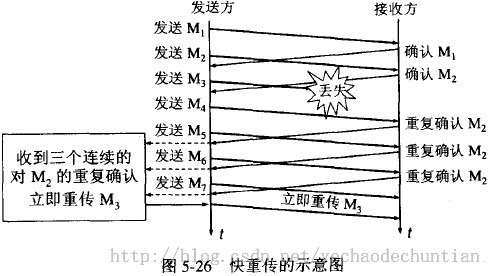

   接收方收到了M1和M2后都分别发出了确认。现在假定接收方没有收到M3但接着收到了M4。显然，接收方不能确认M4，因为M4是收到的失序报文段。根据可靠传输原理，接收方可以什么都不做，也可以在适当时机发送一次对M2的确认。但按照快重传算法的规定，接收方应及时发送对M2的重复确认，这样做可以让发送方及早知道报文段M3没有到达接收方。发送方接着发送了M5和M6。接收方收到这两个报文后，也还要再次发出对M2的重复确认。这样，发送方共收到了接收方的四个对M2的确认，其中后三个都是重复确认。快重传算法还规定，发送方只要一连收到三个重复确认就应当立即重传对方尚未收到的报文段M3，而不必继续等待M3设置的重传计时器到期。由于发送方尽早重传未被确认的报文段，因此采用快重传后可以使整个网络吞吐量提高约20%

2. 快恢复算法
   快恢复算法，其过程有以下两个要点：
   1:当发送方连续收到三个重复确认，就执行“乘法减小”算法，把慢开始门限ssthresh减半。这是为了预防网络发生拥塞。请注意：接下去不执行慢开始算法。 2:由于发送方现在认为网络很可能没有发生拥塞，因此与慢开始不同之处是现在不执行慢开始算法（即拥塞窗口cwnd现在不设置为1），而是把cwnd值设置为慢开始门限ssthresh减半后的数值，然后开始执行拥塞避免算法（“加法增大”），使拥塞窗口缓慢地线性增大。 下图给出了快重传和快恢复的示意图，并标明了“TCP Reno版本”。 区别：新的 TCP Reno 版本在快重传之后采用快恢复算法而不是采用慢开始算法。 

   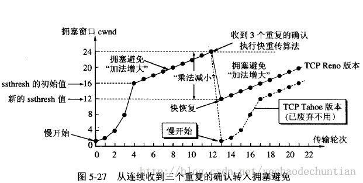

   也有的快重传实现是把开始时的拥塞窗口cwnd值再增大一点，即等于 ssthresh + 3 X MSS 。这样做的理由是：既然发送方收到三个重复的确认，就表明有三个分组已经离开了网络。这三个分组不再消耗网络 的资源而是停留在接收方的缓存中。可见现在网络中并不是堆积了分组而是减少了三个分组。因此可以适当把拥塞窗口扩大了些
   在采用快恢复算法时，慢开始算法只是在TCP连接建立时和网络出现超时时才使用
   采用这样的拥塞控制方法使得TCP的性能有明显的改进
   接收方根据自己的接收能力设定了接收窗口rwnd，并把这个窗口值写入TCP首部中的窗口字段，传送给发送方。因此，接收窗口又称为通知窗口。因此，从接收方对发送方的流量控制的角度考虑，发送方的发送窗口一定不能超过对方给出的接收窗口rwnd
   发送方窗口的上限值 = Min [ rwnd, cwnd ]
   当rwnd < cwnd 时，是接收方的接收能力限制发送方窗口的最大值。
   当cwnd < rwnd 时，则是网络的拥塞限制发送方窗口的最大值。

### 7、TCP中的RST

RST：（Reset the connection）用于复位因某种原因引起出现的错误连接，也用来拒绝非法数据和请求。如果接收到RST位时候，通常发生了某些错误；
发送RST包关闭连接时，不必等缓冲区的包都发出去，直接就丢弃缓冲区中的包，发送RST；
接收端收到RST包后，也不必发送ACK包来确认。

#### 何时发送RST

1：如果连接是CLOSE状态，所有收到的包都响应RST，仍然保持CLOSED状态
如果收到的是ACK报文，RST取ACK报文的ACK序列号为RST报文的SEQ；如果报文不是ACK报文，RST的SEQ为0且ACK字段为收到的报文SEQ+报文长度；

2：如果连接在non-synchronized状态（LISTEN/SYN-SENT/SYN-RECEIVED），收到的报文ACK的无效的序列号（发送的SYN没有被确认），需要返回RST报文；连接保持原有状态；
如果是ACK报文，RST取ACK报文的ACK序列号为RST报文的SEQ；如果报文不是ACK报文，RST的SEQ为0且ACK字段为收到的报文SEQ+报文长度；

3：如果连接在synchronized状态（ESTABLISHED,FIN-WAIT-1, FIN-WAIT-2, CLOSE-WAIT, CLOSING, LAST-ACK, TIME-WAIT）,如果收到不可接受的报文（序列号不在接收窗口内或者ack的字段不正确），只发送一个确认报文（ACK字段为期望ACK的序列号，SEQ为当前发送序列号），状态变保持原样；

具体可以参看RFC793

#### 收到RST报文如何处理

收到RST报文，除了SYN-SENT状态，都需要校验SEQ字段是否在接收窗口；SYN-SENT状态下，如果RST的确认了刚刚发送的SYN报文，RST才有效；

校验了RST报文后，如果是在LISTEN状态则保持该状态不需要改变；
如果是在SYN-RECIEVED状态且之前在LISTEN状态，恢复为LISTEN状态，如果之前为SYN-RECIEVED状态且之前不是LISTEN状态，则CLOSED；
其他状态，关闭连接通知用户，状态变为CLOSED

RFC793给出的几个RST例子 

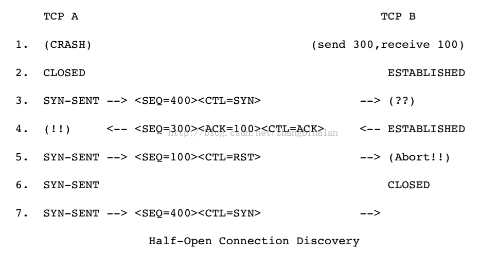

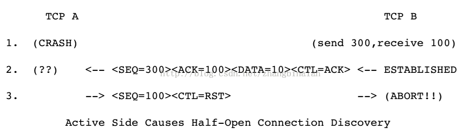

### 8、TCP安全问题

#### 什么是SYN攻击（SYN Flood）

在三次握手过程中，服务器发送 SYN-ACK 之后，收到客户端的 ACK 之前的 TCP 连接称为半连接(half-open connect)此时服务器处于 SYN_RCVD 状态。当收到 ACK 后，服务器才能转入 ESTABLISHED 状态.

SYN 攻击指的是，攻击客户端在短时间内伪造大量不存在的IP地址，向服务器不断地发送SYN包，服务器回复确认包，并等待客户的确认。由于源地址是不存在的，服务器需要不断的重发直至超时，这些伪造的SYN包将长时间占用未连接队列，正常的SYN请求被丢弃，导致目标系统运行缓慢，严重者会引起网络堵塞甚至系统瘫痪
SYN 攻击是一种典型的 DoS/DDoS 攻击。

#### 如何检测 SYN 攻击？

检测 SYN 攻击非常的方便，当你在服务器上看到大量的半连接状态时，特别是源IP地址是随机的，基本上可以断定这是一次SYN攻击。在Linux/Unix上可以使用系统自带的netstats命令来检测SYN攻击

#### 如何防御SYN攻击

SYN攻击不能完全被阻止，除非将TCP协议重新设计。我们所做的是尽可能的减轻SYN攻击的危害，常见的防御 SYN 攻击的方法有如下几种：

1. 缩短超时（SYN Timeout）时间
2. 增加最大半连接数
3. 过滤网关防护
4. SYN cookies技术